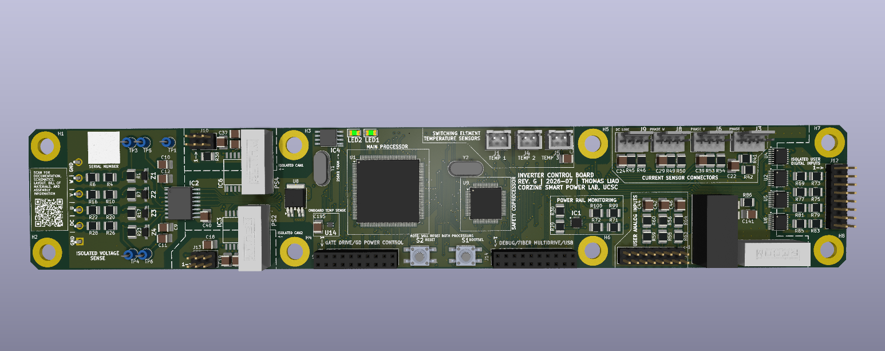
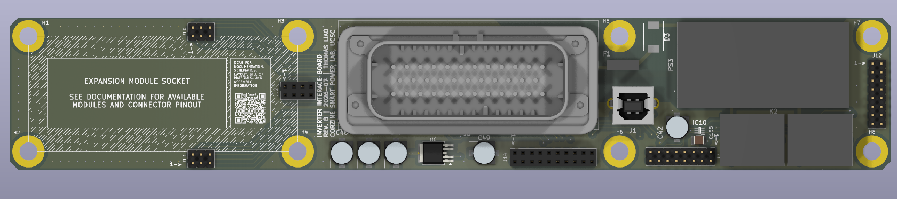
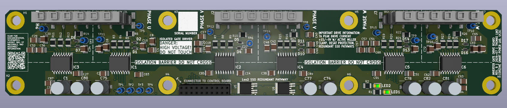
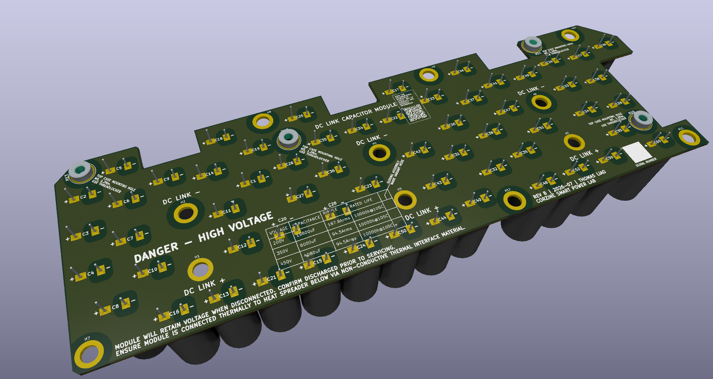
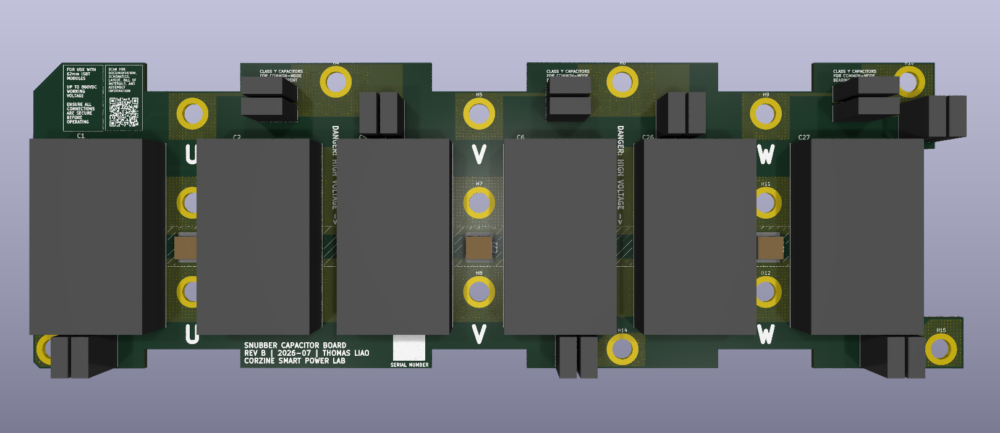

# Document Control

- **MCUs:** STM32H723ZG + STM32G474RCTx
- **Operating Temp:** −40°C to +85°C
- **Reviewed by:** (not yet reviewed)

**Revision History**

| Date | Version | Author | Description |
|------|---------|--------|-------------|
| July 13, 2026 | 2.4 | Project Team | Editorial consistency pass: NCV57100 part update; USB debug description corrected; cross-references updated; precharge current limit corrected to 2 A; placeholder pinout made consistent; DC link cooling and expansion module sections added; hardware overview figures added; voting, companion-doc versions, and isolation ratings corrected. |
| July 8, 2026 | 2.3 | Project Team | Dual-MCU architecture and CAN assignment updates. (entry added retroactively) |
| June 14, 2026 | 2.2 | Project Team | Tone pass: removed defensive marketing language, blanked pinout (placeholder until harness finalized), reduced Sevcon warnings to one clean callout, removed all "Zero" brand references, toned down formal "KNOWN LIMITATION" language, renamed document to User Manual. Added Section 17: modulation strategies (planned feature, 10 schemes, live switching, automatic selection, hysteresis, transition torque blip mitigation, dyno validation plan). |
| June 14, 2026 | 2.1 | Project Team | Removed "Sevcon replacement" marketing. Fixed encoder types (sin/cos or Hall only, not quadrature/resolver). Fixed IGBT spec (1200V standard, 600V optional). Clarified main contactor is driven by BMS/external system, not inverter. Fixed precharge description (high-side, isolated +12V through relay). Fixed switched +12V outputs. Removed all warranty language. Added parasitic drain note. Added no-guarantee disclaimers. |
| June 14, 2026 | 2.0 | Project Team | Complete rewrite. Professional format, two-variant clarification, corrected HVIL description, expanded pinout tables, added safety callouts, troubleshooting and maintenance sections. |
| [Earlier] | 1.x | Project Team | Initial draft versions. |

> **Companion Documents**
>
> This manual covers the electrical interface, integration, and operation of the traction inverter hardware. The following companion documents provide additional detail:
>
> - **HARA (v4.1):** Hazard Analysis and Risk Assessment per ISO 26262. 99 fault injection tests, 18 hazards, 15 safety goals, 21 FSRs. Dual-MCU architecture with STM32G474RCTx coprocessor. Six SSO pathways. ASIL D via ASIL B(D) decomposition.
> - **TARA (v1.2):** Threat Analysis and Risk Assessment per ISO/SAE 21434. 9 cybersecurity tests, 7 CSRs, open-source trust model.
> - **SWAD (v1.5):** Software Architecture Document. 4-layer architecture, FOC + multi-modulation, 6-state state machine, CAN protocol reference.
>
> The **RTE (Real Time Examiner)** open-source tool connects via CAN bus for live monitoring, parameter configuration, and firmware updates.

# 1. Overview

The traction inverter is an open-source motor controller designed for electric drivetrain applications. It converts DC traction battery power to variable-voltage variable-frequency (VVVF) three-phase AC output to drive permanent magnet synchronous motors (PMSM). The unit integrates battery management communication, thermal monitoring, comprehensive safety interlocks, and multi-modulation field-oriented control (FOC).

This manual covers the 140V / 600A variant with the Ampseal 35-pin vehicle connector. This variant includes an onboard railway-grade isolated DC-DC converter that generates +12V logic power from the traction battery. A higher-voltage variant (up to 800V / 800A) is available; see Section 1.1 for details.

> **DANGER — High Voltage**
>
> This device contains lethal voltages up to 160 VDC (43-160 V range). All high-voltage connections are exposed on busbars. Only qualified personnel should install, service, or operate this equipment. Always verify zero energy state with a calibrated voltmeter before touching any terminal.

## 1.1 Product Variants

Two hardware variants are available. The variant described in this manual is the **140V / 600A unit with Ampseal 35-pin connector**.

**Product Variant Comparison**

| Parameter | This Manual: 140V / 600A | Higher-Voltage Variant |
|-----------|--------------------------|------------------------|
| DC Input Voltage | 43 - 160 VDC | Capacitor-only swap to 450 V; PCB + capacitor change to 900 V (covers 800 V target) |
| Continuous Current | 600 A RMS | Up to 800 A RMS |
| Peak Current | 1200 A (time-limited) | Configurable |
| Vehicle Connector | Ampseal 35-pin (TE 776231-1) | User-provided |
| Logic Power | Onboard DC-DC from VIN_Z (included) | External +12V supply required |
| Gate Drive | +15 V / −9 V; >5 kVrms (UL1577), 1424 VPK / 1000 Vrms working (VDE 0884-11) | Same |
| Control Processor | STM32H723ZG | Same |
| IGBT Module | 1200 V (standard) | Same 1200 V module |

> **Variant Note**
>
> This manual describes only the 140V / 600A variant with Ampseal connector. The higher-voltage variant requires the user to provide a separate isolated +12V logic supply and does not include the Ampseal vehicle connector. Contact the project for documentation on other variants.

## 1.2 System Architecture

The traction converter consists of five PCB assemblies:

- **Main Board:** Interface components that repin the board-to-board connectors to the waterproof Ampseal 35 vehicle connector. Contains the 12V logic power module (railway-grade DC-DC), precharge and contactor relays, and signal conditioning for the external vehicle harness.
- **Control Board:** Dual-MCU control architecture. Main processor (STM32H723ZG, 550 MHz Cortex-M7) runs FOC motor control, sensor acquisition, CAN communication, and safe state management. Safety coprocessor (STM32G474RCTx, 170 MHz Cortex-M4+FPU) provides independent monitoring of all safety-critical signals, 1oo2 gate drive power kill, challenge/response watchdog, independent CAN bus snooping, and CY15B102Q-SXET 256 KB FRAM for fault logs and configuration.
- **Gate Driver Board:** Isolated gate drive power supplies, six-channel PWM gate drive with desaturation protection, active Miller clamp, and hardware PWM disable. Interfaces directly to the IGBT power module.
- **DC Bus Capacitor Board:** DC link capacitor bank (60× 330 µF / 200 V aluminium electrolytic capacitors, 19.8 mF total) on an aluminium heat-spreader plate for thermal coupling to the heatsink (Section 5). The 450 V capacitor-only upgrade swaps to 60× Nichicon UCS2W680MHD 68 µF / 450 V parts (4.08 mF total) and reduces the standoff length by 5 mm (e.g., 55 mm → 50 mm).
- **DC Bus Filter Board:** Snubber capacitor board mounted at the IGBT module phase terminals (U/V/W) to filter switching transients.

The Main Board aggregates all external vehicle connections through the Ampseal 35 connector and routes signals to the Control Board and Gate Driver Board via internal board-to-board cabling. All high-voltage circuitry is galvanically isolated from the low-voltage control domain.

## 1.3 External Connections

**External Electrical Connections**

| Connection | Type | Description |
|------------|------|-------------|
| Ampseal 35-pin | Sealed connector (TE 776231-1) | All control, communication, sensing, and auxiliary power signals |
| DC Link Positive | Busbar lug | HV DC input from battery pack (after precharge) |
| DC Link Negative | Busbar lug | HV DC return to battery negative |
| Phase U, V, W | Busbar lugs | Three-phase AC output to traction motor stator windings |
| USB-B | Exterior port | Debug log output, firmware update (Section 15) |

## 1.4 Internal Debug Interfaces

Several internal connectors are available for debugging and firmware flashing. Using these requires partial disassembly of the inverter. When reassembling, ensure all waterproofing seals are correctly seated.

- **USB-B Internal:** Raw USB D+/D− routed directly to the coprocessor's (STM32G474RCTx) native USB 2.0 full-speed (12 Mbit/s) interface for debug logs and firmware updates (Section 15). The port is not bus-powered — the inverter must be externally powered for the USB interface to operate.
- **J-Link Connector:** Standard ARM debug connector for firmware flashing, debugging, and reading memory. RDP (Readout Protection) is never set on the STM32H723ZG — debugging is always possible.

> **WARNING — Do Not Set RDP**
>
> Setting RDP Level 1 or 2 on the STM32H723ZG will prevent firmware updates and debugging. The factory default is RDP Level 0 (no protection). If you use custom firmware, ensure your flashing tool does not set RDP. A bricked MCU can be recovered via the J-Link connector with RDP Level 0. With RDP Level 2, recovery is impossible.

> **CAUTION — Reassembly**
>
> Damage caused by improper disassembly, connection, or reassembly is the user's responsibility. No warranty is provided — this is an open-source hardware project. Always verify waterproofing seals are intact after servicing. Modified firmware may compromise safety-critical functions; the user assumes all risk.

## 1.5 Hardware Overview

The renders below show the major PCB assemblies of the inverter.

***Control Board** — Dual-MCU control: STM32H723ZG main processor (FOC, sensor acquisition, CAN) and STM32G474RCTx safety coprocessor (independent monitoring, 1oo2 gate drive power kill).*

***IO Board** (the "Main Board" of Section 1.2) — Vehicle interface: Ampseal 35-pin connector, railway-grade 43-160 V to +12 V DC-DC converter, precharge and auxiliary relay drives, J2 expansion connector (Section 18).*

***Gate Driver Board** — Six isolated NCV57100 gate drive channels with +15 V / −9 V Murata supplies, DESAT protection, and active Miller clamp.*

***DC Bus Capacitor Board** — DC link capacitor bank: 60× 330 µF / 200 V aluminium electrolytic capacitors (19.8 mF total). 450 V upgrade: 60× Nichicon UCS2W680MHD 68 µF / 450 V (4.08 mF total) with 5 mm shorter standoffs. No onboard bleeder — see Section 2.1.*

***DC Bus Filter Board** — Snubber capacitor board mounted at the IGBT module phase terminals (U/V/W).*

# 2. Safety Information

## 2.1 High Voltage Warnings

> **DANGER — Lethal Voltage Present**
>
> The DC link busbars carry the full traction battery voltage (43-160 VDC). This voltage is lethal. Always treat the DC link as energized until verified otherwise with a calibrated voltmeter. Never work on the inverter with the battery connected. Remove the B+ fuse or open the main line contactor before servicing.

> **DANGER — Capacitor Stored Energy**
>
> The DC link capacitor bank (19.8 mF) has **no onboard bleeder** and remains charged at full bus voltage for hours after the battery is disconnected. Do not rely on any fixed wait time. Before touching any HV terminal, verify zero voltage with a calibrated voltmeter across DC Link Positive and Negative, and discharge the bank through a power resistor if any voltage remains.

## 2.2 General Safety

- Only qualified personnel should install, configure, or service this equipment.
- Always wear appropriate personal protective equipment (PPE) when working with high-voltage systems.
- Ensure the installation location provides adequate cooling. The inverter requires a user-provided heatsink (Section 5).
- The inverter draws quiescent power from the battery even when not actively inverting. For long-term storage, disconnect VIN_Z (Section 3).
- Do not connect or disconnect the Ampseal 35-pin connector while the system is powered.
- Do not operate the inverter without the enclosure lid properly sealed — the HVIL will detect this, but the interlock is a signal, not a physical barrier.

## 2.3 This Connector is NOT Sevcon-Compatible

> **DANGER — Pinout Incompatibility**
>
> The Ampseal 35-pin connector on this inverter is **NOT** pin-compatible with Sevcon Gen4 harnesses. Connecting a Sevcon harness to this inverter will cause immediate equipment damage, fire, and potential personal injury. Always verify pin-to-pin compatibility with the pinout tables in Section 7 before making any connection.

This inverter replaces legacy Sevcon Gen4 controllers in aftermarket conversion applications, but the vehicle harness must be rewired to match the pinout defined in this manual. A wiring adapter or new harness fabrication is required. Do not attempt to use an unmodified Sevcon harness.

# 3. Idle Power Draw and Storage

> **WARNING — Standby Power Consumption**
>
> The traction inverter draws quiescent power from the battery via VIN_Z even when not actively inverting. If left unattended, this standby consumption will discharge the battery pack and may cause permanent cell damage.

For rolling stock or vehicles requiring long-term unattended storage:

- **Complete isolation:** Disconnect or remove power to VIN_Z to eliminate all standby power draw during storage.
- **Storage mode:** The system can be configured to wake periodically (daily or weekly) to check battery state-of-charge (SOC) via the BMS CAN bus. If pack voltage drops below a configured threshold, the system initiates a maintenance charge cycle. In storage mode, the control processor wakes from low-power state, samples the DC link voltage, and commands the precharge/contactor logic if supplemental charging is required.

> **Note — No Hardware Sleep Pin**
>
> The inverter does not include a dedicated hardware sleep-enable pin or an ultra-low quiescent mode. The only way to eliminate standby power draw is to physically disconnect VIN_Z. A future hardware revision may add a low-power sleep state or a sleep-control input. For long-term storage, a battery disconnect switch or timer-controlled relay on the VIN_Z line is recommended.

For maximum safety during extended storage, always physically isolate the high-voltage input by removing the B+ fuse or opening the main line contactor.

# 4. High Voltage Interlock (HVIL)

The High Voltage Interlock Loop (HVIL) is a safety-critical signal path between the inverter and the Battery Management System (BMS). It is important to understand that **the inverter does not directly open the contactor** — the HVIL is a presence signal, and the BMS is responsible for contactor control.

### How HVIL Works

1. The inverter provides a +5V source (O_+5V_HVIL_SOURCE_A) referenced to CAN1_GND.
2. This +5V is routed in series through all high-voltage connectors and the enclosure lid switch in the vehicle.
3. The return (I_+5V_HVIL_RETURN_A) comes back to the inverter, completing the loop.
4. When the loop is intact, the inverter asserts the SYSTEM_ON signal to the BMS, indicating it is safe to operate.
5. If any HV connector is unmated or the enclosure is opened, the loop breaks, SYSTEM_ON is deasserted, and the **BMS opens the main contactor**.
6. Upon SYSTEM_ON deassertion, the inverter immediately disables all PWM outputs and enters a safe state.

> **HVIL is a Signal, Not a Contactor Drive**
>
> The inverter does not control the contactor directly. The HVIL is a +5V interlock loop that the BMS monitors for integrity. When the loop opens, the BMS (not the inverter) opens the contactor. The inverter's role is to (1) provide the +5V source, (2) detect the return, (3) assert/deassert SYSTEM_ON, and (4) disable PWM when SYSTEM_ON goes away. Ensure your BMS is configured to open the contactor on SYSTEM_ON deassertion.

> **WARNING — Isolated Grounds**
>
> The BMS signal ground (CAN1_GND) is isolated from traction negative. Do not tie CAN1_GND or signal ground (GND_A) to the HV negative bus. Doing so compromises the safety isolation and may cause equipment damage or personal injury.

# 5. Thermal Management

The traction inverter does not include an integrated heatsink or cooling system. The device is provided with a flat mechanical backplate. The user must provide external thermal management:

- Apply thermal interface material (thermal grease or phase-change pad) between the device backplate and the heatsink or chassis mounting surface.
- Provide adequate heat removal (heatsink, liquid cooling plate, or chassis thermal path) sized for the continuous power output of the application.
- Ensure the mounting surface is flat and clean to minimize thermal contact resistance.

The IGBT junction temperature is monitored internally via three NTC thermistors (one per IGBT module). The firmware implements progressive thermal derating:

**Thermal Derating Thresholds**

| Temperature | Action |
|-------------|--------|
| < 80°C | Full torque available |
| 80°C | Linear derate: 100% to 50% torque (80-90°C range) |
| 90°C | Torque limited to 25% |
| 95°C | Warning logged (non-critical) |
| 100°C | Critical fault: ramp torque to zero, safe state |

> **Thermal Design Margin**
>
> The 100°C hard cap provides a 75°C safety margin to the IGBT rated maximum junction temperature of 175°C. The real-time loss estimator predicts junction temperature from a thermal model and can warn the operator of impending thermal limits before the hard cap is reached. All thermal parameters are configurable via the RTE tool.

### DC Link Capacitor Cooling

The DC link capacitor bank is thermally coupled to a 3.18 mm (1/8 in) aluminium heat-spreader plate, which mounts to the heatsink via six 55 mm aluminium standoffs (13 mm OD). The thermal path is sized for a 40 W ripple-current heat load at rated operation.

With thermal paste at the interfaces, the plate temperature rise is approximately 40°C above the heatsink base — about 80°C plate temperature at a 40°C heatsink base. Use **aluminium standoffs only** — steel standoffs are thermally unacceptable. The full analysis is documented in Docs/DC_LINK_THERMAL_ANALYSIS.md.

# 6. Specifications

**Electrical Specifications — 140V / 600A Variant**

| Parameter | Value | Notes |
|-----------|-------|-------|
| DC Input Voltage | 140 VDC nominal (43-160 VDC range) | 43-160 VDC configurable range |
| Continuous Output Current | 600 A RMS | Thermal limit depends on user cooling |
| Peak Output Current | 1200 A | Configurable, time-limited |
| Output Type | 3-phase AC, IGBT-based | VVVF drive for PMSM motors |
| Switching Frequency | 300 Hz - 16 kHz | User-configurable via RTE; default 2 kHz SVPWM |
| Modulation Schemes | SPWM, SVPWM, ARSVPWM, SHEPWM, RCFM, RSPWM, N-Pulse / N-Pulse Wide / N-Pulse Custom, RSVM | SPWM and SVPWM implemented; remainder architected / in development — see Section 17 |
| Power Device | Mitsubishi 1200V IGBT module | 6-switch full bridge |
| Gate Drive Voltage | +15V / -9V | Positive turn-on, negative turn-off |
| Gate Drive Isolation | >5 kVrms (UL1577) | Galvanic, reinforced |
| Current Sensing | STM32H723 16-bit ADC | 4 channels (I_U, I_V, I_W, I_DC) |
| Voltage Sensing | MAX22530 isolated ADC | 4 channels (V_DC, V_U, V_V, V_W) |
| Control Interface | Dual isolated CAN 2.0B | Up to 1 Mbps each |
| Digital Inputs | 8x ISO1212 isolated (2 populated in current build) | 24-60V field inputs, galvanically isolated from logic domain |
| Relay Outputs | 4x switched +12V | Precharge and auxiliary relay drive (not the main HV contactor) |
| Logic Power | VIN_Z via DC-DC | 43-160V in, +12V out, 20W, railway grade |
| HVIL | 5V inline interlock loop | Signal to BMS; BMS controls contactor |
| Operating Temperature | -40°C to +85°C | Ambient at backplate |
| Isolation (Logic to Traction) | Reinforced, railway grade | Full galvanic isolation |
| Control Processor | STM32H723ZG | Cortex-M7, 550 MHz, 1 MB flash |
| Non-Volatile Storage | SPI FRAM | Unlimited write endurance, WP pin |
| Debug Interface | USB-B (native USB 2.0 FS) | External port, isolated |
| Firmware Update | USB-B or CAN bus | Both use same protocol |

# 7. Ampseal 35-Pin Connector

All vehicle-facing signals route through the Ampseal 35-pin sealed connector (TE 776231-1). The connector is keyed and cannot be rotated 180 degrees — the key prevents incorrect mating. Always verify the key orientation before mating.

> **DANGER — Pinout Not Yet Finalized**
>
> The pin assignments below are **placeholder only**. Pin numbers are shown as "—" until the harness design is finalized. Do not wire your vehicle harness based on this manual. A finalized pinout will be released in a future revision. Contact the project for the current draft pinout if you are building a test harness.

**Connector Summary**

| Function Group | Pin Count |
|----------------|-----------|
| CAN Bus 1 (BMS) | 4 |
| CAN Bus 2 (Dash / Charger) | 4 |
| Throttle Inputs | 2 |
| Motor Position / Temperature | 10 |
| Power and Keyswitch | 3 |
| HVIL | 2 |
| Precharge / HV Control | 4 |
| CAN Termination | 2 |
| Reserved / Unused | 4 |

## 7.1 CAN Bus 1 (BMS)

**CAN Bus 1 — BMS and Peripheral Interface**

| Pin | Signal | Description |
|-----|--------|-------------|
| — | CAN1_L | CAN Bus 1 Low |
| — | CAN1_H | CAN Bus 1 High |
| — | CAN1_GND | CAN Bus 1 ground (isolated from traction negative) |
| — | GND_A | Signal ground (isolated from traction negative) |

## 7.2 CAN Bus 2 (Dash / Charger)

**CAN Bus 2 — Dashboard, Charger, and Diagnostic Interface**

| Pin | Signal | Description |
|-----|--------|-------------|
| — | CAN2_L | CAN Bus 2 Low |
| — | CAN2_H | CAN Bus 2 High |
| — | CAN2_GND | CAN Bus 2 ground (isolated from traction negative) |
| — | GND_A | Signal ground (shared with CAN1) |

> **Dual Isolated CAN Buses**
>
> CAN Bus 1 is designated for BMS and powertrain-critical nodes. CAN Bus 2 is for dashboard, charger, and diagnostic tools. Both buses are galvanically isolated from traction negative and from each other. The CAN protocol is user-configurable via the RTE tool — frame IDs, scaling factors, and periods can be modified for vehicle-specific integration.

## 7.3 Throttle Inputs

**Analog Throttle / Torque Demand Input**

| Pin | Signal | Description |
|-----|--------|-------------|
| — | THROTTLE | Analog throttle / torque demand input (redundant potentiometer, 0-5 V scaled to 0-3.3 V at the ADC) |
| — | THROTTLE_GND | Throttle signal return (single-ended, referenced to AGND) |

> **WARNING — Throttle Wiring**
>
> The throttle signal is referenced to AGND, not to the traction battery negative. Do not connect throttle ground to HV negative. Use a 3-wire shielded cable for the throttle connection. The shield should be grounded at the inverter end only to avoid ground loops.

## 7.4 Motor Position / Temperature

**Motor Position Sensor Interface (Sin/Cos or Hall)**

| Pin | Signal | Description |
|-----|--------|-------------|
| — | MOT_T1+ | Motor temperature sensor 1 (+), 0.01" wire |
| — | MOT_T1- | Motor temperature sensor 1 (-), 0.01" wire |
| — | MOT_T2+ | Motor temperature sensor 2 (+) |
| — | MOT_T2- | Motor temperature sensor 2 (-) |
| — | SIN+ | Sin/Cos encoder sine channel (+) / Hall U |
| — | SIN- | Sin/Cos encoder sine channel (-) / Hall V |
| — | COS+ | Sin/Cos encoder cosine channel (+) / Hall W |
| — | COS- | Sin/Cos encoder cosine channel (-) / Hall common |
| — | REF+ | Sin/Cos reference mark (+) / Hall VCC (+5V) |
| — | REF- | Sin/Cos reference mark (-) / Hall GND |

> **Encoder Type Configuration**
>
> The firmware supports **sin/cos (synchro-style) encoders** and **digital Hall effect sensors**. Sin/cos encoders provide absolute position via analog sine/cosine differential signals. Hall sensors provide 60-degree electrical sector commutation. **Quadrature encoders and resolvers are NOT supported.** The pin names reflect the primary (sin/cos) function with the Hall mapping in parentheses. Configure the sensor type via the RTE tool before first run. Verify sensor type and pinout with the motor manufacturer.

## 7.5 Power and Keyswitch

**Power Input and Keyswitch Interface**

| Pin | Signal | Description |
|-----|--------|-------------|
| — | VIN_Z | +43-160VDC logic supply input (via onboard DC-DC). This input powers all internal logic, gate drive, and auxiliary circuits. |
| — | KEYSWITCH | Keyswitch input (connect to battery positive via keyswitch) |
| — | KEYSWITCH_RET | Keyswitch return |

> **WARNING — VIN_Z is Not Optional**
>
> VIN_Z must be connected for the inverter to operate. This input powers the onboard DC-DC converter that generates +12V for all internal logic and gate drive circuits. Without VIN_Z, the inverter is completely non-functional. For storage, VIN_Z can be disconnected to prevent battery drain (Section 3).

## 7.6 HVIL

**High Voltage Interlock Loop**

| Pin | Signal | Description |
|-----|--------|-------------|
| — | O_+5V_HVIL_SOURCE_A | HVIL +5V source output (referenced to CAN1_GND) |
| — | I_+5V_HVIL_RETURN_A | HVIL +5V return input (from interlock loop) |

The HVIL is a +5V series loop that runs through all high-voltage connectors and the enclosure lid switch. When the loop is intact, the inverter asserts SYSTEM_ON to the BMS. When the loop opens (connector unmated or lid opened), SYSTEM_ON is deasserted and the BMS opens the main contactor. See Section 4 for full HVIL description.

## 7.7 Precharge / HV Control

**Precharge Control and HV Taps**

| Pin | Signal | Description |
|-----|--------|-------------|
| — | O_12V_PRECHARGE_ENABLE | Precharge relay drive output (+12V, high-side isolated) |
| — | O_12V_RELAY_AUX | Auxiliary relay drive output (+12V) — NOT the main HV contactor |
| — | I_VIN_HIGH_A | High-side HV tap for precharge voltage monitoring |
| — | I_VIN_LOW_A | Low-side HV tap for precharge voltage monitoring |

## 7.8 CAN Termination

**CAN Bus Termination Resistors**

| Pin | Signal | Description |
|-----|--------|-------------|
| — | CAN1_TERM | CAN Bus 1 120-ohm termination (jumper-selectable) |
| — | CAN2_TERM | CAN Bus 2 120-ohm termination (jumper-selectable) |

> **CAN Termination**
>
> The termination resistors are enabled or disabled by on-board jumpers (CAN1/CAN2 termination jumpers). In a typical vehicle network, the BMS or another node provides termination at the opposite end of the bus. Enable termination on the inverter only if it is at the physical end of the bus. The jumpers allow termination to be fitted without external resistors.

## 7.9 Reserved Pins

**Reserved / Unused Pins**

| Pin | Signal | Description |
|-----|--------|-------------|
| — | NC | Reserved for future use |
| — | NC | Reserved for future use |
| — | NC | Reserved for future use |
| — | NC | Reserved for future use |

# 8. Power Supply Architecture

The power supply system consists of three subsystems that provide regulated and isolated power for all internal circuits.

## 8.1 Logic Power (VIN_Z)

VIN_Z is the primary input for all internal power. An onboard railway-grade isolated DC-DC converter (1500 Vdc I/O isolation) converts the 43-160 VDC traction battery voltage to regulated +12V logic power. This converter provides up to 20W, which is sufficient for the MCU, gate drive, CAN transceivers, sensors, and all auxiliary circuits.

The DC-DC converter is enabled by the keyswitch input. When the keyswitch is off, the converter is disabled and the inverter draws no power (except for microamp leakage current through the keyswitch detection circuit).

## 8.2 Switched +12V Output

The +12V from the DC-DC converter is distributed to four switched outputs for driving external relays:

- **O_12V_PRECHARGE_ENABLE:** Drives the precharge relay. The precharge relay controls a resistor-limited path that charges the DC link capacitor before the main contactor closes. The precharge relay is on the **high side** (battery positive path), not the low side. The +12V drive is isolated and routed through the relay coil.
- **O_12V_RELAY_AUX:** Auxiliary relay drive for vehicle-specific functions (e.g., cooling pump, fan, indicator light). **This is NOT the main HV contactor.** The main HV contactor is controlled by the BMS or other external safety system, not by this inverter.
- **CAN Bus 1 and 2 power:** Isolated +5V CAN transceiver power derived from the +12V rail.

## 8.3 Isolated Sensor and Communication Rails

From the +12V rail, multiple isolated DC-DC converters generate the regulated voltages required by specific subsystems:

- **Gate drive power (+15V / -9V):** Six isolated Murata converters provide gate drive voltage for the six IGBT switches. Positive rail (+15V) for fast turn-on; negative rail (-9V) for fast turn-off and Miller clamp.
- **CAN transceiver power (+5V isolated):** Isolated +5V for both CAN bus transceivers, maintaining galvanic isolation from traction negative.
- **Sensor power (+5V isolated):** Isolated +5V for current sensors, temperature sensors, and encoder interface.

> **Gate Drive Isolation**
>
> Each of the six gate drive channels has its own isolated DC-DC converter. This provides per-channel isolation — a fault on one channel cannot propagate to others through the gate drive power supply. Each Murata MGJ2D121509MPC-R7 gate-drive DC/DC provides 5.2 kVDC input-to-output isolation. The gate-driver isolation barrier (NCV57100) is rated >5 kVrms per UL1577 and 1424 VPK / 1000 Vrms working voltage per VDE 0884-11.

# 9. Gate Drive

Each IGBT is driven by an isolated gate driver channel with the following features:

- **+15V / -9V gate drive:** Positive voltage for rapid turn-on; negative voltage for rapid turn-off and active Miller clamp.
- **Active Miller clamp:** Prevents false turn-on during high dv/dt switching by clamping the gate to the negative rail during the off state.
- **Desaturation detection (DESAT):** Monitors the IGBT Vce during the on-state. If Vce exceeds the desaturation threshold, indicating a short-circuit condition, the driver immediately turns off the IGBT and asserts the FLT output.
- **Fault output (FLT):** Six individual FLT signals are OR'd together and fed to TIM1_BKIN. When any driver detects a fault, all PWM outputs are immediately disabled by hardware (SSO) within <100 ns.
- **Power supply monitoring (UVLO):** Each driver monitors its own isolated gate drive supply. If the supply drops below the UVLO threshold, the driver turns off the IGBT and asserts FLT.

> **Gate Drive Supply Kill — 1oo2 Architecture**
>
> Two independent MCUs can each disable all six gate drive power supplies: GATE_DRIVE_PWR1_ENABLE (main STM32H723) and GATE_DRIVE_PWR2_ENABLE (coprocessor STM32G474). Either enable going low shuts down the Murata supplies, the NCV57100 drivers detect UVLO, and force all IGBT gates to 0V via internal active pull-downs. This is a 1oo2 architecture — either MCU can achieve SSO independently. Independent feedback is provided: GATE_DRIVE_PWR1_FB (main MCU) and GATE_DRIVE_PWR2_FB (coprocessor). The FLT signal additionally confirms UVLO detection. Six total SSO pathways exist; see the HARA (v4.1) Section 2.2 for full details.

# 10. Sensing and Acquisition

### Current Sensing

Phase currents (I_U, I_V, I_W) and DC link current (I_DC) are measured using Tamura LA37S Hall-effect current transducers with 1.042 mV/A sensitivity and +/-1200 A range. The outputs are conditioned to 0-3.3V for the STM32H723's 16-bit ADC.

Each phase current is sampled on the primary ADC at 16-bit resolution, with redundant 12-bit channels on secondary ADCs for fault detection. The ADC oversamples at an integer multiple (n x) of the PWM switching frequency, up to 48 kSPS, with sinc3 decimation for noise reduction. See SWAD (v1.5) Section 4.2 for full ADC architecture details.

### Voltage Sensing

DC link voltage (V_DC) and all three phase voltages (V_U, V_V, V_W) are measured using the MAX22530 4-channel isolated 12-bit ADC. The MAX22530 provides reinforced isolation between the high-voltage measurement domain and the low-voltage logic domain via its internal reinforced barrier, with SPI interface to the STM32H723.

Each channel uses a 1001:1 high-voltage divider (4× 250 kΩ + 1 kΩ), giving a measurable range to ~1.8 kV full-scale.

### Temperature Sensing

Three NTC thermistors are mounted to the IGBT module baseplate — one per module — for junction temperature estimation. The firmware uses 2-out-of-3 (2oo3) voting: the outlier sensor is excluded and the higher of the two agreeing readings is used, with progressive derating starting at 80°C and a hard cap at 100°C. Motor temperature sensors (if fitted) are connected via the MOT_T1/MOT_T2 pins on the Ampseal connector (Section 7.4; pin numbers are placeholder pending harness finalization).

# 11. External Precharge

> **WARNING — Main HV Contactor is NOT Driven by This Inverter**
>
> The main high-voltage contactor that connects the battery to the inverter DC link is **controlled by the BMS or other external safety system**, not by this inverter. The inverter only drives the **precharge relay** (a smaller relay that limits inrush current through a resistor). Do not connect the main contactor coil to any inverter output — this is a safety-critical function that must be managed by the BMS.

The precharge function uses a **high-side relay** in the battery positive path. A precharge resistor limits the current that charges the DC link capacitor when the system is first powered. The +12V relay drive is isolated from the traction high voltage. The relay closes the precharge path; once the DC link voltage reaches ~95% of battery voltage, the BMS closes the main contactor and the precharge relay opens.

> **CAUTION — Precharge Current Limit**
>
> The precharge resistor is external and user-supplied. Size it so that the peak precharge current stays below 2 A — the input fuse limit on the precharge path. Exceeding this limit will blow the fuse.

The inverter provides four signals to support the precharge function:

**Precharge Interface Signals**

| Signal | Pin | Type | Description |
|--------|-----|------|-------------|
| O_12V_PRECHARGE_ENABLE | — | Output, +12V isolated | Drives the precharge relay (high-side, resistor-limited path) |
| O_12V_RELAY_AUX | — | Output, +12V | Auxiliary relay drive (NOT main contactor) |
| I_VIN_HIGH_A | — | Input, HV | High-side tap for precharge voltage monitoring |
| I_VIN_LOW_A | — | Input, HV | Low-side tap for precharge voltage monitoring |

The firmware monitors the voltage difference between I_VIN_HIGH_A and I_VIN_LOW_A during the precharge sequence. When the DC link capacitor voltage reaches approximately 95% of the battery voltage, the inverter signals precharge complete to the BMS via CAN. The **BMS then closes the main contactor**. The inverter does not close the main contactor itself.

# 12. Dual Isolated CAN Bus

The inverter includes two independent CAN 2.0B buses, each with full galvanic isolation from traction negative and from each other. Each ISO1042BDWVR transceiver pair is rated for VIORM 2121 VPK.

**CAN Bus Assignment**

| Parameter | CAN Bus 1 | CAN Bus 2 |
|-----------|-----------|-----------|
| Pins | — | — |
| Nodes | BMS, IO board | Dashboard, charger, diagnostic tools |
| Bitrate | 500 kbps (default) | 500 kbps (default) |
| Termination | Jumper-selectable | Jumper-selectable |
| Isolation | 2.5 kVrms | 2.5 kVrms |

> **CAN Protocol is User-Configurable**
>
> The CAN frame definitions in this manual are a reference implementation only. All CAN IDs, scaling factors, periods, and frame layouts are stored in FRAM and can be modified via the RTE (Real Time Examiner) configuration tool. The VCU does not enforce a rigid protocol — the user defines their own communication scheme for vehicle-specific integration. See the SWAD (v1.5) Section 10 for the reference frame definitions.

> **CAUTION — Encoder and BMS are Out of Scope**
>
> This inverter does not include or supply the traction motor, rotor position sensor (sin/cos encoder or hall sensor), battery management system, IO board, charger, or vehicle display. These are external products that interface with the inverter via the CAN bus and analog/digital I/O. This manual documents the inverter-side interface only. Refer to the motor manufacturer, BMS manufacturer, and vehicle OEM for their respective documentation.

# 13. CAN Protocol

The CAN protocol is defined by the user via the RTE configuration tool. The following tables describe the default frame assignments. All IDs, periods, and scaling factors are user-modifiable.

### VCU Transmitted Frames (TX)

| CAN ID | Name | Period | Key Signals |
|--------|------|--------|-------------|
| 0x18F00100 | VCU_Status | 100 ms | State, fault flags |
| 0x18F00200 | VCU_Motor | 50 ms | Speed (rpm), torque (Nm), I_q, I_d |
| 0x18F00300 | VCU_Power | 100 ms | V_DC, I_DC, power (kW) |
| 0x18F00400 | VCU_Thermal | 500 ms | T_IGBT[0-2], T_junction_est |
| 0x18F00500 | VCU_LossEst | 500 ms | P_total_loss, time_to_OT_sec |
| 0x18F00600 | VCU_Heartbeat | 1000 ms | Seq counter, uptime |
| 0x18F00700 | VCU_FaultLog | Event | Event code + detail |

### VCU Received Frames (RX)

| CAN ID | Source | Key Signals |
|--------|--------|-------------|
| 0x18F10100 | BMS | SOC, SOH, pack voltage, pack current |
| 0x18F20100 | IO Board | Throttle primary, throttle check |
| 0x18F20200 | IO Board | Key on, brake, kickstand |
| 0x18F20300 | IO Board | Heartbeat (timeout: 1000 ms) |
| 0x18F30100 | Charger | Charger state, max current |
| 0x18F40100 | Diagnostic | UDS-style commands |
| 0x18F50100 | RTE Host | Parameter read/write |

# 14. BMS Interface

The inverter communicates with the Battery Management System (BMS) via CAN Bus 1. The default CAN frame IDs are listed in Section 13, but these are user-configurable via RTE.

### Heartbeat Supervision

The inverter monitors heartbeats from the BMS and IO board. If a heartbeat is not received within the timeout period, the inverter enters a fault state and ramps torque to zero:

**Heartbeat Timeout Configuration (Defaults)**

| Node | Frame | Period | Timeout | Action |
|------|-------|--------|---------|--------|
| IO Board | IO_Heartbeat | 100 ms | 1000 ms | FAULT_CAN_TIMEOUT, ramp to zero |
| BMS | BMS_Status | 100 ms | 5000 ms | FAULT_CAN_TIMEOUT, ramp to zero |
| Charger | Chgr_Status | 1000 ms | 5000 ms | Stop charging session |

### SYSTEM_ON Signal

The inverter asserts SYSTEM_ON when:

- HVIL loop is intact (all connectors mated, lid closed)
- Keyswitch is on
- POST passed successfully
- No critical faults are active

SYSTEM_ON is deasserted when any of these conditions fails. The BMS must be configured to open the main contactor on SYSTEM_ON deassertion.

# 15. USB-B Debug Port

An external USB-B connector provides access to the debug and firmware update interface. The USB-B port routes raw USB D+/D− directly to the coprocessor's (STM32G474RCTx) native USB 2.0 full-speed (12 Mbit/s) interface. The port is **not bus-powered** — the inverter must be powered from its external supply for the USB interface to operate; plugging in a laptop alone will not power the board.

### Functions

- **Debug log output:** Real-time status messages, fault logs, and diagnostic data
- **Firmware update:** Same protocol as CAN bus update (HMAC-SHA256 signed, chunk-based)
- **RTE tunnel:** RTE commands can be sent via USB-B when CAN is unavailable

### Isolation

The USB-B port is galvanically isolated from the traction high-voltage domain. It is safe to connect a laptop to the USB-B port while the inverter is powered from the traction battery. However, for maximum safety, use an additional USB isolator between the laptop and the inverter when working on a live system.

> **WARNING — USB Isolator Recommended**
>
> While the USB-B port is internally isolated, an additional external USB isolator (e.g., Adafruit USB Isolator, 1 kV isolation) is strongly recommended when connecting a laptop to a live traction system. This provides defense in depth against ground fault paths through the laptop chassis.

# 16. Maintenance and Troubleshooting

## 16.1 Common Faults

**Troubleshooting Guide**

| Symptom | Possible Cause | Action |
|---------|----------------|--------|
| No response to keyswitch | VIN_Z not connected or open fuse | Check VIN_Z voltage at the connector with a voltmeter. Verify fuse. |
| POST fails on boot | Gate driver fault pin stuck low; FRAM WP fault | Check FLT line at TIM1_BKIN. Run POST diagnostics via USB-B. |
| No torque output | Throttle plausibility fault; position sensor not detected | Check throttle wiring at the connector. Verify sin/cos or Hall signal on USB-B debug log. |
| BMS contactor won't close | HVIL loop open; SYSTEM_ON not asserted; BMS not closing contactor | Check HVIL continuity at the connector. Verify 5V source is present. Check BMS is configured to close contactor on SYSTEM_ON. |
| CAN communication fault | Wrong bitrate; missing termination | Verify CAN bitrate matches BMS (default 500 kbps). Check termination jumpers. |
| Thermal derating | Inadequate cooling; stuck-high temp sensor | Check heatsink mounting and TIM. Verify all three NTC readings via RTE. |
| Overcurrent fault | Shorted motor phase; incorrect current sensor zero | Disconnect motor and check phase-to-phase resistance. Run zero-cal via RTE. |
| PWM not outputting | Keyswitch off; brake applied; throttle deadband | Check keyswitch state, brake switch, throttle above deadband. Check state machine log. |

## 16.2 Debug Interface Warning

> **WARNING — Authorized Use Only**
>
> The debug interface and firmware update capability are provided for development, diagnostic, and authorized repair purposes only. Access to these interfaces allows modification of safety-critical parameters including current limits, thermal thresholds, and fault response behavior. Modification of these parameters without proper understanding of the system can result in equipment damage, fire, or personal injury. Always maintain a known-good firmware image and parameter set before making changes.

> **Open Source**
>
> This project is open source. Firmware source code, schematics, and all documentation are available on the project GitHub repository. The STM32H723ZG is shipped with RDP Level 0 (no readout protection) — debugging and firmware modification are always possible. The user is the root of trust. The project explicitly rejects anti-user security mechanisms (OTP fuses, vendor-locked keys, encrypted bootloaders with unreplaceable keys). Physical tampering is an acceptable risk per the open-source trust model documented in the TARA (v1.2).

> **CAUTION — Third-Party Firmware**
>
> Only firmware obtained from the official project repository or built from audited source code is supported. Third-party firmware may disable safety features, override thermal limits, or introduce software faults. Use of unverified firmware is at the user's own risk. The HARA (v4.1) fault injection test results apply only to the official firmware. No fitness for purpose is guaranteed for any firmware configuration.

# 17. Motor Control and Modulation Strategies

> **Note — Planned Feature**
>
> The multi-modulation architecture described in this section is planned for a future firmware release. The current firmware implements SPWM and SVPWM. Expanded modulation support, live switching, and automatic selection are under development. Planned validation on a dynamometer at a university lab.

The firmware implements an adaptive pulse-width modulation framework. The user can select from multiple modulation schemes, switch between them during operation, and configure automatic selection rules based on operating conditions. All modulation parameters are accessible via the RTE tool over CAN bus.

## 17.1 Available Modulation Schemes

**Modulation Schemes (Planned)**

| Scheme | Description | Typical Application |
|--------|-------------|---------------------|
| SPWM | Sinusoidal Pulse Width Modulation. Three-phase sine references compared with a triangular carrier. Simple, low harmonic content at high modulation indices. | General purpose; smooth operation at moderate speeds |
| SVPWM | Space Vector Pulse Width Modulation. Uses eight voltage vectors (six active, two zero) to synthesize the reference. Higher DC bus utilization than SPWM (~15% more). | High torque, efficient operation |
| ARSVPWM | Alternating Reverse Sequence Vector PWM. A variant of SVPWM that alternates the switching sequence pattern every other carrier period to spread harmonic energy and reduce peak current ripple. | Low-noise applications; spread-spectrum-like benefits |
| SHEPWM | Selective Harmonic Elimination PWM. Pre-computed switching angles eliminate specific low-order harmonics. Requires solve-at-runtime or pre-calculated angle tables. | High-speed operation where specific harmonics must be suppressed |
| RCFM | Random Carrier Frequency Modulation. The PWM carrier frequency is dithered randomly within a configured band to spread electromagnetic interference across a wide spectrum. | EMI-sensitive installations; reduces tonal acoustic noise |
| RSPWM | Random Sinusoidal Pulse Width Modulation. Combines random carrier frequency with random pulse position to maximize EMI spreading. | Maximum EMI reduction; aerospace and sensitive environments |
| N-Pulse | Low pulse-count operation for very high speeds. The inverter switches only a few times per electrical cycle. Requires careful current reconstruction. | Field weakening region; very high motor speeds |
| N-Pulse Wide | Extended N-Pulse with wider conduction angles. Trade-off between switching loss and current ripple at extreme speeds. | Extended field weakening beyond base N-Pulse range |
| N-Pulse Custom | User-defined pulse count and angle pattern. For experimental or application-specific modulation. | Research and custom motor applications |
| RSVM | Random Space Vector Modulation. Randomly selects between different valid vector sequences on each carrier period to spread harmonics. | Mid-speed range; alternative to RCFM with better DC utilization |

## 17.2 Live Switching and Automatic Selection

The user can switch between modulation schemes at runtime via CAN bus commands. Two modes of operation are supported:

- **Manual mode:** The user explicitly selects the active modulation scheme via RTE. The switch occurs at the next zero-current or zero-voltage crossing to minimize disturbance.
- **Automatic mode:** The user defines a modulation map that selects the scheme based on real-time operating conditions. Parameters include motor speed, torque demand, DC link voltage, and thermal state.

Example automatic selection map:

**Example Modulation Map (User-Configurable)**

| Speed Range | Torque | Selected Scheme | Rationale |
|-------------|--------|-----------------|-----------|
| 0 - 20% base | Any | ARSVPWM | Low speed, low ripple, quiet operation |
| 20% - 80% base | High | SVPWM | Maximum DC bus utilization |
| 20% - 80% base | Low | RCFM | Spread EMI at light load |
| 80% - 100% base | Any | SHEPWM | Eliminate low-order harmonics at high speed |
| > 100% base (field weak) | Any | N-Pulse | Minimize switching losses |

> **WARNING — Transition Torque Blips**
>
> Switching modulation schemes during active torque production can cause brief torque disturbances. The bumpless transfer logic crossfades the voltage reference over several PWM periods, but a small transient is unavoidable when the harmonic structure changes abruptly. The firmware gates scheme transitions during critical moments (high di/dt, regen/acceleration crossover) to prevent perceptible torque blips. Do not request a scheme switch during hard acceleration or braking unless you have validated the transition behavior on your specific motor.

> **Hysteresis on Scheme Boundaries**
>
> When operating near a speed or torque boundary between two modulation schemes, the automatic selector applies hysteresis to prevent rapid back-and-forth switching. The hysteresis band is user-configurable (default: 5% of the switching parameter). For example, if the SVPWM-to-SHEPWM boundary is at 80% base speed, the firmware will switch to SHEPWM at 80% but will not switch back to SVPWM until speed drops below 75%. This eliminates audible jitter and unnecessary torque transients at boundary conditions.

## 17.3 Configuration via CAN Bus

All modulation parameters are exposed through the RTE configuration interface over CAN bus:

- **Active scheme:** Read/write the currently selected modulation (manual mode) or the active map slot (automatic mode).
- **Modulation map:** Define up to 8 speed/torque regions with per-region scheme selection. Upload via RTE parameter write.
- **Transition timing:** Configure the crossfade duration (in PWM periods) for bumpless transfers.
- **Hysteresis bands:** Set the hysteresis width for each map boundary.
- **SHE angle table:** Upload pre-computed switching angles for SHEPWM. Supports live recalculation for variable DC link voltage.
- **RCFM band:** Set the minimum and maximum carrier frequency for random dithering.

> **WARNING — Validate on Your Hardware**
>
> Modulation scheme behavior varies with motor inductance, winding configuration, and mechanical resonance. Always validate modulation selection and transition behavior on your specific hardware before deploying in a vehicle. Torque ripple, acoustic noise, and EMI characteristics are motor-dependent. The automatic selection map should be tuned for your application.

# 18. Expansion Module

> **Note — Planned Feature**
>
> All expansion modules described in this section are planned. The J2 expansion connector exists on the IO board, but no plug-in modules are available yet.

The IO board provides a J2 expansion connector carrying MD_FIBER_TX, MD_FIBER_RX, MD_FIBER_SYNC, +5 V, +12 V, and GND. This connector supports the following planned plug-in modules:

- **Fiber IO multidrive module (planned):** Distributed drive configurations — motors with five or more phases, and parallel power stages with current sharing and load balancing, with hardware PWM synchronization between stages over fiber.
- **Fiber-optic gate-drive module (planned):** Isolated PWM delivered directly to the gate drivers over fiber optics.
- **WiFi/Bluetooth telemetry module (planned):** Wireless telemetry for monitoring and diagnostics.
- **Resolver interface module (planned):** Adds resolver position feedback. Without this module, native position inputs remain sin/cos encoder or Hall effect only (Section 7.4).
