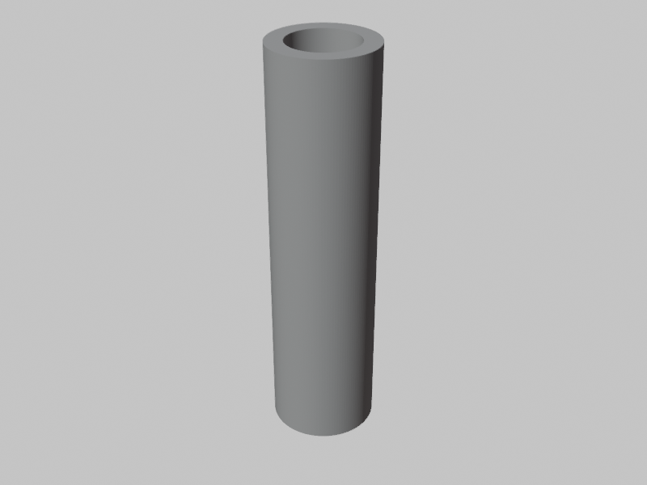
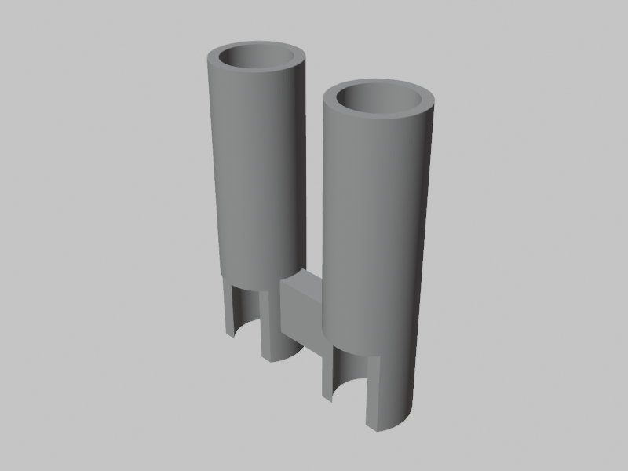
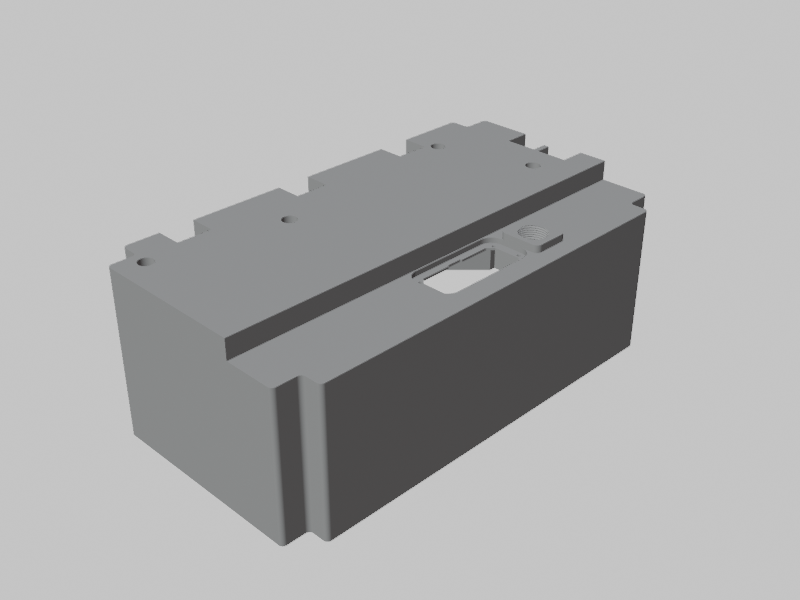
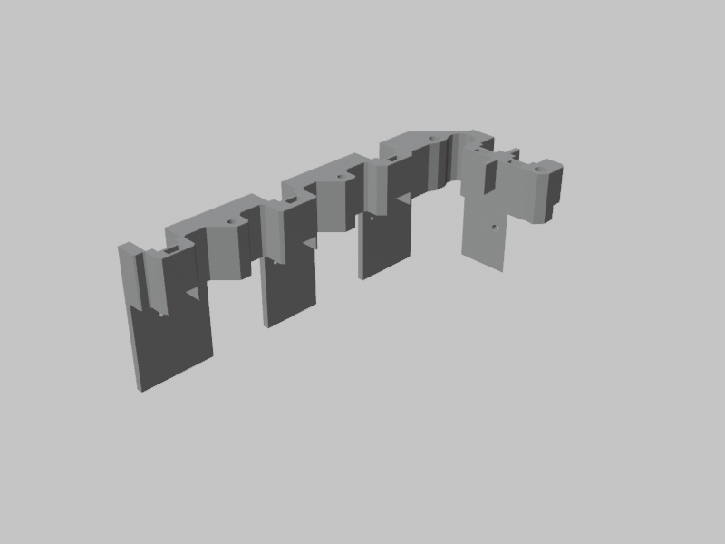
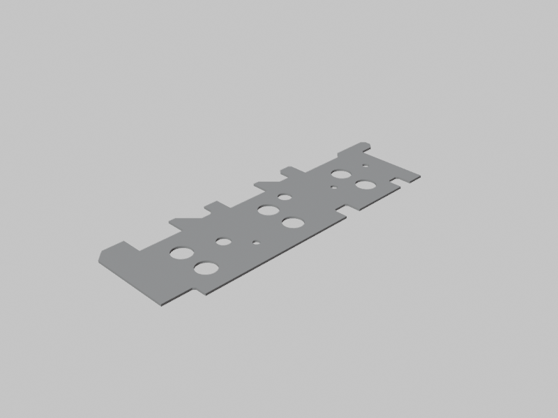
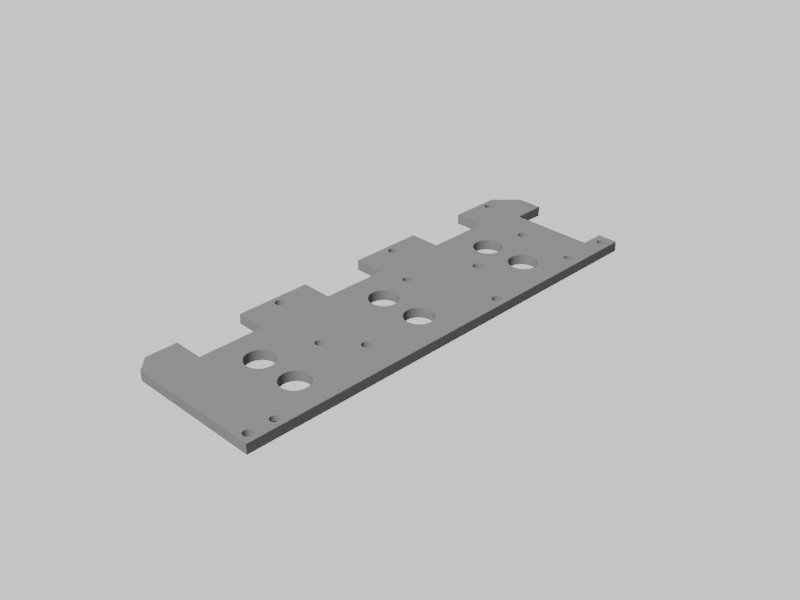

# Hardware BOM Pricing Report

Generated: 2026-08-30T06:47:26.650992Z

Base quantity: 1 unit(s)

---

## In-House Assembly

| Qty | Order | Internal P/N | Description | Part Number | Unit Price | Line Total | Source |
|-----|-------|--------------|-------------|-------------|------------|------------|--------|
| 1 |  | HW-C2-WH-TSBCM-A | CapacitorTempSenseHarness |  | N/A | N/A | manual |
| 4 |  | HW-C2-WH-CS-A | CurrentSenseHarness |  | N/A | N/A | manual |
| 1 |  | HW-C2-WH-GDVS-A | GDVSHarness |  | N/A | N/A | manual |
| 2 |  | HW-C2-WH-TSIGBT-A | TempSenseHarness |  | N/A | N/A | manual |

**In-House Assembly subtotal:** $0.00

## McMaster-Carr

| Qty | Order | Internal P/N | Description | Part Number | Unit Price | Line Total | Source |
|-----|-------|--------------|-------------|-------------|------------|------------|--------|
| 1 |  | HW-C2-MECH-1821A55-A | 1821A55 | 1821A55 | N/A | N/A | mcmaster_scrape |
| 8 |  | HW-C2-MECH-6926K352-A | 6926K352 | 6926K352 | N/A | N/A | mcmaster_scrape |
| 5 |  | HW-C2-MECH-6926K56-A | 6926K56 | 6926K56 | N/A | N/A | mcmaster_scrape |
| 1 |  | HW-C2-MECH-7381K23-A | 7381K23 | 7381K23 | N/A | N/A | mcmaster_scrape |
| 8 | 1 pack x 100 (left 92) | HW-C2-MECH-90128A232-A | 90128A232 | 90128A232 | N/A | N/A | mcmaster_scrape |
| 5 | 1 pack x 50 (left 45) | HW-C2-MECH-90225A102-A | 90225A102 | 90225A102 | N/A | N/A | mcmaster_scrape |
| 4 |  | HW-C2-MECH-91292A108-A | 91292A108 | 91292A108 | N/A | N/A | mcmaster_scrape |
| 18 | 1 pack x 50 (left 32) | HW-C2-MECH-91292A134-A | 91292A134 | 91292A134 | N/A | N/A | mcmaster_scrape |
| 1 |  | HW-C2-MECH-91458A112-A | 91458A112 | 91458A112 | N/A | N/A | mcmaster_scrape |
| 6 | 1 pack x 25 (left 19) | HW-C2-MECH-91502A180-A | 91502A180 | 91502A180 | N/A | N/A | mcmaster_scrape |
| 6 | 1 pack x 10 (left 4) | HW-C2-MECH-91502A183-A | 91502A183 | 91502A183 | N/A | N/A | mcmaster_scrape |
| 4 |  | HW-C2-MECH-92125A228-A | 92125A228 | 92125A228 | N/A | N/A | mcmaster_scrape |
| 4 |  | HW-C2-MECH-94180A351-A | 94180A351 | 94180A351 | N/A | N/A | mcmaster_scrape |
| 6 |  | HW-C2-MECH-94669A190-A | 94669A190 | 94669A190 | N/A | N/A | mcmaster_scrape |
| 6 |  | HW-C2-MECH-94669A196-A | 94669A196 | 94669A196 | N/A | N/A | mcmaster_scrape |
| 12 |  | HW-C2-MECH-94669A199-A | 94669A199 | 94669A199 | N/A | N/A | mcmaster_scrape |
| 12 |  | HW-C2-MECH-96738A257-A | 96738A257 | 96738A257 | N/A | N/A | mcmaster_scrape |
| 25 | 1 pack x 25 (left 0) | HW-C2-MECH-98044A224-A | 98044A224 | 98044A224 | N/A | N/A | mcmaster_scrape |

**McMaster-Carr subtotal:** $0.00

## Mouser

| Qty | Order | Internal P/N | Description | Part Number | Unit Price | Line Total | Source |
|-----|-------|--------------|-------------|-------------|------------|------------|--------|
| 70 |  | HW-C2-CAP-100N-A | 100nF 100V | 80-C1210C104K1RAC | $0.1610 | $11.27 | manual |
| 21 |  | HW-C2-CAP-10N-A | 10nF 500V | 187-CL32B103KGFNNNE | $0.1430 | $3.00 | manual |
| 37 |  | HW-C2-CAP-10U-A | 10uF 25V | 187-CL32A106KAULNNE | $0.1340 | $4.96 | manual |
| 8 |  | HW-C2-CAP-1U-A | 1uf 50V | 187-CL32B105KBHNNNE | $0.2400 | $1.92 | manual |
| 2 |  | HW-C2-CAP-2U2-A | 2.2uf 1210 100v | 80-C1210C225J1RAUTO | $0.5200 | $1.04 | manual |
| 6 |  | HW-C2-CAP-220P-A | 220pF 100V C0G 1210 | 80-C1210C221J2G | $0.8800 | $5.28 | manual |
| 4 |  | HW-C2-CAP-22P-A | 22pF 50V | 80-C1210C220J5G | $0.7400 | $2.96 | manual |
| 2 |  | HW-C2-IC-8MHZ-A | 8mhz hc49-4h crystal | 710-830003156B | $0.5000 | $1.00 | manual |
| 1 |  | HW-C2-IC-CY15B102Q-SXET-A | CY15B102Q-SXET | 727-CY15B102Q-SXET | $18.1400 | $18.14 | manual |
| 4 |  | HW-C2-IC-ISO1042BDWVR-A | ISO1042BDWVR | 595-ISO1042BDWVR | $4.4400 | $17.76 | manual |
| 1 |  | HW-C2-IC-ISO1212DBQ-A | ISO1212DBQ | 595-ISO1212DBQ | $1.7300 | $1.73 | manual |
| 1 |  | HW-C2-IC-MAX22530AWE-A | MAX22530AWE+ | 700-MAX22530AWE+ | $15.6000 | $15.60 | manual |
| 6 |  | HW-C2-IC-NCV57100DWR2G-A | NCV57100DWR2G | 863-NCV57100DWR2G | $2.9800 | $17.88 | manual |
| 1 |  | HW-C2-IC-STM32G474RCT3-A | STM32G474RCT3 | 511-STM32G474RCT3 | $8.3100 | $8.31 | manual |
| 1 |  | HW-C2-IC-STM32H723ZGT6-A | STM32H723ZGT6 | 511-STM32H723ZGT6 | $13.2500 | $13.25 | manual |
| 1 |  | HW-C2-CONN-SSW-110-01-F-D-A | SSW-110-01-F-D | 200-SSW11001FD | $2.4100 | $2.41 | manual |
| 1 |  | HW-C2-CONN-TSW-110-21-L-D-LL-A | TSW-110-21-L-D-LL | 200-TSW11021LDLL | $2.2700 | $2.27 | manual |
| 8 |  | HW-C2-HW-0022011042-A | 0022011042 |  | N/A | N/A | manual |
| 32 |  | HW-C2-HW-08-50-0113-A | 08-50-0113 |  | N/A | N/A | manual |
| 4 |  | HW-C2-HW-22-04-1041-A | 22-04-1041 | 538-22-04-1041 | $0.8900 | $3.56 | manual |
| 3 |  | HW-C2-HW-455-2266-ND-A | 455-2266-ND | 306-XHP-2 | $0.1000 | $0.30 | manual |
| 25 |  | HW-C2-HW-464762-E-A | 464762-E | 305-464762 | $0.3970 | $9.93 | manual |
| 5 |  | HW-C2-HW-524265-E-A | 524265-E | 305-524265-E | $7.8700 | $39.35 | manual |
| 5 |  | HW-C2-HW-544959-E-A | 544959-E |  | N/A | N/A | manual |
| 1 |  | HW-C2-HW-776231-1-A | 776231-1 | 571-776231-1 | $16.6900 | $16.69 | manual |
| 1 |  | HW-C2-HW-951-GP1500-080-02-A | 951-GP1500-080-02 | 951-GP1500-080-02 | N/A | N/A | unknown |
| 8 |  | HW-C2-HW-971150581-A | 971150581 | 710-971150581 | $0.6000 | $4.80 | manual |
| 8 |  | HW-C2-HW-971250581-A | 971250581 | 710-971250581 | $1.1000 | $8.80 | manual |
| 8 |  | HW-C2-HW-971350581-A | 971350581 | 710-971350581 | $1.4800 | $11.84 | manual |
| 8 |  | HW-C2-HW-9774030592R-A | 9774030592R | 710-9774030592R | $1.5700 | $12.56 | manual |
| 2 |  | HW-C2-HW-ACT45B-101-2P-TL003-A | ACT45B-101-2P-TL003 | 810-ACT45B1012PTL003 | $1.5300 | $3.06 | manual |
| 2 |  | HW-C2-HW-AWHSH105D00G-A | AWHSH105D00G | 523-AWHSH105D00G | $1.1100 | $2.22 | manual |
| 3 |  | HW-C2-HW-B2B-XH-AM_LF__SN_-A | B2B-XH-AM_LF__SN_ | 306-B2B-XH-AMLFSNP | $0.1000 | $0.30 | manual |
| 12 |  | HW-C2-HW-B58031U9254M062-A | B58031U9254M062 | 871-B58031U9254M062 | $4.6500 | $55.80 | manual |
| 12 |  | HW-C2-HW-BAT54WS-7-F-A | BAT54WS-7-F | 621-BAT54WS-F | $0.1240 | $1.49 | manual |
| 5 |  | HW-C2-HW-BTS462TATMA1-A | BTS462TATMA1 | 726-BTS462TATMA1 | $2.6600 | $13.30 | manual |
| 3 |  | HW-C2-HW-CM600DY-24T-A | CM600DY-24T (CM600DY-13T recommended for Chassis Size 2 200-450 V; 24T also compatible) | CM600DY-24T | $323.5000 | $970.50 | manual |
| 1 |  | HW-C2-HW-DRDNB21D-7-A | DRDNB21D-7 | 621-DRDNB21D-7 | $0.5600 | $0.56 | manual |
| 1 |  | HW-C2-HW-EC7BW-110S12-A | EC7BW-110S12 | 418-EC7BW-110S12 | $48.8600 | $48.86 | manual |
| 12 |  | HW-C2-HW-FDFNYD1-110-5-A | FDFNYD1-110(5) | 161-FDFNYD1-1105 | $0.4800 | $5.76 | manual |
| 4 |  | HW-C2-HW-LA37S600S05KM-A | LA37S600S05KM | 838-LA37S600S05KM | $19.9600 | $79.84 | manual |
| 1 |  | HW-C2-HW-LT3080IQ-PBF-A | LT3080IQ#PBF | 584-LT3080IQ#PBF | $8.5400 | $8.54 | manual |
| 2 |  | HW-C2-HW-LTST-C230CKT-A | LTST-C230CKT | 859-LTST-C230CKT | $0.4100 | $0.82 | manual |
| 2 |  | HW-C2-HW-LTST-C230GKT-A | LTST-C230GKT | 859-LTST-C230GKT | $0.3600 | $0.72 | manual |
| 1 |  | HW-C2-HW-MF-RHT200_32-2-A | MF-RHT200_32-2 | 652-MF-RHT200/32-2 | $0.6100 | $0.61 | manual |
| 6 |  | HW-C2-HW-MGJ2D121509MPC-R7-A | MGJ2D121509MPC-R7 | 580-MGJ2D121509MPCR7 | $6.7700 | $40.62 | manual |
| 6 |  | HW-C2-HW-MKP1848S61010JY5B-A | MKP1848S61010JY5B | 75-MKP1848S61010JY5B | $7.5400 | $45.24 | manual |
| 5 |  | HW-C2-HW-MM3Z3V0ST1G-A | MM3Z3V0ST1G | 863-MM3Z3V0ST1G | $0.1700 | $0.85 | manual |
| 1 |  | HW-C2-HW-NXFT15XH103FEAB021-A | NXFT15XH103FEAB021 | 81-NXFT15XH103FEAB21 | $0.3400 | $0.34 | manual |
| 1 |  | HW-C2-HW-RD7-12S033R-A | RD7-12S033R | 737-RD7-12S033R | $6.7700 | $6.77 | manual |
| 3 |  | HW-C2-HW-RKE-1205S_H-A | RKE-1205S_H | 919-RKE-1205S/H | $5.1700 | $15.51 | manual |
| 2 |  | HW-C2-HW-RTS103C1R2M6L201-A | RTS103C1R2M6L201 | 527-RTS103C1R2M6L201 | $2.2700 | $4.54 | manual |
| 2 |  | HW-C2-HW-S3N-A | S3N | 512-S3N | $0.6700 | $1.34 | manual |
| 2 |  | HW-C2-HW-SSW-103-01-L-D-A | SSW-103-01-L-D | 200-SSW10301LD | $1.3400 | $2.68 | manual |
| 1 |  | HW-C2-HW-SSW-104-01-L-D-A | SSW-104-01-L-D | 200-SSW10401LD | $1.6900 | $1.69 | manual |
| 2 |  | HW-C2-HW-SSW-108-01-L-D-A | SSW-108-01-L-D | 200-SSW10801LD | $2.3500 | $4.70 | manual |
| 1 |  | HW-C2-HW-SSW-110-01-F-D-A | SSW-110-01-F-D |  | N/A | N/A | manual |
| 1 |  | HW-C2-HW-STS41A-AWLB-R3-A | STS41A-AWLB-R3 | 403-STS41A-AWLB-R3 | $1.1300 | $1.13 | manual |
| 6 |  | HW-C2-HW-STTH112A-A | STTH112A | 511-STTH112A | $0.5900 | $3.54 | manual |
| 6 |  | HW-C2-HW-SXH-001T-P0-6-A | SXH-001T-P0.6 | 306-SXH-001T-P0.6 | $0.1000 | $0.60 | manual |
| 4 |  | HW-C2-HW-SZMMSZ4678T1G-A | SZMMSZ4678T1G | 863-SZMMSZ4678T1G | $0.4300 | $1.72 | manual |
| 21 |  | HW-C2-HW-TESTPOINT-TH-RED-A | Testpoint TH, RED | 534-5000 | $0.2930 | $6.15 | manual |
| 1 |  | HW-C2-HW-TPS389006ADJRTER-A | TPS389006ADJRTER | 595-TPS389006ADJRTER | $5.1000 | $5.10 | manual |
| 2 |  | HW-C2-HW-TS40-66-50-R-260-SMT-TR-A | TS40-66-50-R-260-SMT-TR | 179-TS406650R260S | $0.4800 | $0.96 | manual |
| 2 |  | HW-C2-HW-TSW-103-18-G-D-A | TSW-103-18-G-D | 200-TSW10318GD | $1.0100 | $2.02 | manual |
| 2 |  | HW-C2-HW-TSW-108-18-F-D-A | TSW-108-18-F-D | 200-TSW10818FD | $1.4500 | $2.90 | manual |
| 1 |  | HW-C2-HW-TSW-110-18-T-D-A | TSW-110-18-T-D | 200-TSW11018TD | $1.5800 | $1.58 | manual |
| 13 |  | HW-C2-HW-UCM1H101MCL1GS-A | UCM1H101MCL1GS | 647-UCM1H101MCL1GS | $0.3250 | $4.23 | manual |
| 60 |  | HW-C2-HW-UCS2D331MHD-A | UCS2D331MHD | 647-UCS2D331MHD | $2.1600 | $129.60 | manual |
| 1 |  | HW-C2-HW-UJ2-B-HR-G-V-A | UJ2-B-HR-G-V | 179-UJ2-B-HR-G-V | $1.7000 | $1.70 | manual |
| 18 |  | HW-C2-HW-VY1222M47Y5UQ6TV0-A | VY1222M47Y5UQ6TV0 | 72-VY1222M47Y5UQ6TV0 | $0.2710 | $4.88 | manual |
| 27 |  | HW-C2-RES-10K-A | 10k 1210 | 603-AC1210JR-0710KL | $0.0500 | $1.35 | manual |
| 4 |  | HW-C2-RES-120-A | 120 1210 | 603-AC1210FR-07120RL | $0.1000 | $0.40 | manual |
| 17 |  | HW-C2-RES-1K-A | 1k 1210 | 603-RC1210FR-071KL | $0.0490 | $0.83 | manual |
| 12 |  | HW-C2-RES-2R7-A | 2.7 ohm 1210 | 667-ERJ-14BQF2R7U | $0.2340 | $2.81 | manual |
| 16 |  | HW-C2-RES-20K-A | 20k 1210 resistor | 667-ERJ-P14F2002U | $0.2450 | $3.92 | manual |
| 1 |  | HW-C2-RES-220-A | 220 1210 | 603-RC1210FR-07220RL | $0.1000 | $0.10 | manual |
| 3 |  | HW-C2-RES-3K-A | 3k 1210 1% | 603-RC1210FR-073KL | $0.1000 | $0.30 | manual |
| 3 |  | HW-C2-RES-4K7-A | 4.7k 1210 | 71-CRCW12104K70FKEAH | $0.5900 | $1.77 | manual |
| 1 |  | HW-C2-RES-499K-A | 499kohm 1210 resistor | 667-ERJ-P14F4993U | $0.4400 | $0.44 | manual |
| 2 |  | HW-C2-RES-560-A | 560ohm 1210 resistor | 667-ERJ-P14F5600U | $0.4400 | $0.88 | manual |
| 16 |  | HW-C2-RES-250K-A | Thick Film Resistors - SMD 1/2watt 249Kohms 1% | 71-CRCW1210-249K-E3 | $0.0700 | $1.12 | manual |

**Mouser subtotal:** $1733.29

## PCB Fabrication

| Qty | Order | Internal P/N | Description | Part Number | Unit Price | Line Total | Source |
|-----|-------|--------------|-------------|-------------|------------|------------|--------|
| 1 |  | HW-C2-PCB-CTRL-A | ControlBoard | ControlBoard | N/A | N/A | unknown |
| 1 |  | HW-C2-PCB-DCBUSCAP-A | DCBusCapacitorBoard | DCBusCapacitorBoard | N/A | N/A | unknown |
| 1 |  | HW-C2-PCB-DCFLT-A | DCBusFilter | DCBusFilter | N/A | N/A | unknown |
| 1 |  | HW-C2-PCB-GD-A | GateDriver | GateDriver | N/A | N/A | unknown |
| 1 |  | HW-C2-PCB-IO-A | IOBoard | IOBoard | N/A | N/A | unknown |

**PCB Fabrication subtotal:** $0.00

## SendCutSend

| Qty | Order | Internal P/N | Description | Part Number | Unit Price | Line Total | Source |
|-----|-------|--------------|-------------|-------------|------------|------------|--------|
| 6 |  | HW-C2-3DP-DC-LINK-MODULE-HOLDER-SP-A | DC Link Module Holder Spacer - Printed | DC Link Module Holder Spacer - Printed | N/A | N/A | sendcutsend_folder |
| 3 |  | HW-C2-3DP-DCLSPCR-PRINTED-A | HW-C2-DCLSPCR-PRINTED-B | HW-C2-DCLSPCR-PRINTED-B | N/A | N/A | sendcutsend_folder |
| 1 |  | HW-C2-3DP-SHELL-PRINTED-A | HW-C2-SHELL-PRINTED-A | HW-C2-SHELL-PRINTED-A | N/A | N/A | sendcutsend_folder |
| 2 |  | HW-C2-BB-DCLBB-A | HW-C2-DCLBB-A | HW-C2-DCLBB-A | $52.6400 | $105.28 | sendcutsend_folder |
| 3 |  | HW-C2-BB-PBB-A | HW-C2-PBB-A | HW-C2-PBB-A | $20.3200 | $60.96 | sendcutsend_folder |
| 1 |  | HW-C2-HW-DC-LINK-MODULE-HOLDER-A | DC Link Module Holder - 200V Class | DC Link Module Holder - 200V Class | N/A | N/A | sendcutsend_folder |
| 1 |  | HW-C2-HW-THERMAL-PAD-CUTTING-STEN-A | Thermal Pad Cutting Stencil | Thermal Pad Cutting Stencil | N/A | N/A | sendcutsend_folder |
| 1 |  | HW-C2-PLT-BSP-A | HW-C2-BSP-A | HW-C2-BSP-A | $207.5400 | $207.54 | sendcutsend_folder |
| 1 |  | HW-C2-PLT-CHSP-A | HW-C2-CHSP-B | HW-C2-CHSP-B | $42.6400 | $42.64 | sendcutsend_folder |

**SendCutSend subtotal:** $416.42

---

## Grand Total (1 unit): **$2149.71**

## Quantity Scaling

| Quantity | Estimated Total |
|----------|----------------|
| 1 | $2149.71 |
| 2 | $4299.42 |
| 3 | $6449.13 |
| 5 | $10748.56 |
| 10 | $21497.11 |

## Pack Rounding & Stock

| Part | Need | On Hand | Order | Leftover |
|------|------|---------|-------|----------|
| 90128A232 | 8 | - | 1 pack x 100 | 92 |
| 90225A102 | 5 | - | 1 pack x 50 | 45 |
| 91292A134 | 18 | - | 1 pack x 50 | 32 |
| 91502A180 | 6 | - | 1 pack x 25 | 19 |
| 91502A183 | 6 | - | 1 pack x 10 | 4 |
| 98044A224 | 25 | - | 1 pack x 25 | 0 |

## Unknown / Missing Prices

- CapacitorTempSenseHarness (assembly)
- CurrentSenseHarness (assembly)
- GDVSHarness (assembly)
- TempSenseHarness (assembly)
- 1821A55 (mcmaster)
- 6926K352 (mcmaster)
- 6926K56 (mcmaster)
- 7381K23 (mcmaster)
- 90128A232 (mcmaster)
- 90225A102 (mcmaster)
- 91292A108 (mcmaster)
- 91292A134 (mcmaster)
- 91458A112 (mcmaster)
- 91502A180 (mcmaster)
- 91502A183 (mcmaster)
- 92125A228 (mcmaster)
- 94180A351 (mcmaster)
- 94669A190 (mcmaster)
- 94669A196 (mcmaster)
- 94669A199 (mcmaster)
- 96738A257 (mcmaster)
- 98044A224 (mcmaster)
- 0022011042 (mouser)
- 08-50-0113 (mouser)
- 544959-E (mouser)
- 951-GP1500-080-02 (mouser)
- SSW-110-01-F-D (mouser)
- ControlBoard (pcb)
- DCBusCapacitorBoard (pcb)
- DCBusFilter (pcb)
- GateDriver (pcb)
- IOBoard (pcb)
- DC Link Module Holder Spacer - Printed (sendcutsend)
- HW-C2-DCLSPCR-PRINTED-B (sendcutsend)
- HW-C2-SHELL-PRINTED-A (sendcutsend)
- DC Link Module Holder - 200V Class (sendcutsend)
- Thermal Pad Cutting Stencil (sendcutsend)

## SendCutSend Part Details

### DC Link Module Holder Spacer - Printed

- **Qty (per unit):** 6
- **Material:** Nylon (PA12 or PA6/66)
- **Thickness:** N/A mm
- **Finish:** as printed
- **Unit Price:** N/A
- **STEP:** `../Mechanical/Fab/HW-C2-DCLMH-200-SPCR-PRINTED-A/HW-C2-DCLMH-200-SPCR-PRINTED-A.step`

### HW-C2-DCLSPCR-PRINTED-B

- **Qty (per unit):** 3
- **Material:** Nylon (PA12 or PA6/66, solid)
- **Thickness:**  mm
- **Finish:** as printed
- **Unit Price:** N/A
- **STEP:** `../Mechanical/Fab/HW-C2-DCLSPCR-PRINTED-B/HW-C2-DCLSPCR-PRINTED-B.step`

### HW-C2-SHELL-PRINTED-A

- **Qty (per unit):** 1
- **Material:** Nylon (PA12 or PA6/66, solid)
- **Thickness:**  mm
- **Finish:** as printed
- **Unit Price:** N/A
- **STEP:** `../Mechanical/Fab/HW-C2-SHELL-PRINTED-A/HW-C2-SHELL-PRINTED-A.step`

### HW-C2-DCLBB-A

- **Qty (per unit):** 2
- **Material:** Copper
- **Thickness:** 4.75 mm
- **Finish:** Bending
- **Unit Price:** $52.64
- **STEP:** `../Mechanical/Fab/HW-C2-DCLBB-A/HW-C2-DCLBB-A.step`

### HW-C2-PBB-A

- **Qty (per unit):** 3
- **Material:** Copper
- **Thickness:** 4.75 mm
- **Finish:** Bending
- **Unit Price:** $20.32
- **STEP:** `../Mechanical/Fab/HW-C2-PBB-A/HW-C2-PBB-A.step`

### DC Link Module Holder - 200V Class

- **Qty (per unit):** 1
- **Material:** 
- **Thickness:** 35.50 mm
- **Finish:** as printed
- **Unit Price:** N/A
- **STEP:** `../Mechanical/Fab/HW-C2-DCLMH-200-PRINTED-B/HW-C2-DCLMH-200-PRINTED-B.step`

### Thermal Pad Cutting Stencil

- **Qty (per unit):** 1
- **Material:** PLA
- **Thickness:** N/A mm
- **Finish:** as printed
- **Unit Price:** N/A
- **STEP:** `../Mechanical/Fab/HW-C2-THRMLPD-STNCL-A/HW-C2-THRMLPD-STNCL-A.step`

### HW-C2-BSP-A

- **Qty (per unit):** 1
- **Material:** 6061 T6 Aluminum
- **Thickness:** 9.52 mm
- **Finish:** Deburring, Tapping
- **Unit Price:** $207.54
- **STEP:** `../Mechanical/Fab/HW-C2-BSP-A/HW-C2-BSP-A.step`

### HW-C2-CHSP-B

- **Qty (per unit):** 1
- **Material:** 6061 T6 Aluminum
- **Thickness:** 6.35 mm
- **Finish:** Deburring
- **Unit Price:** $42.64
- **STEP:** `../Mechanical/Fab/HW-C2-CHSP-B/HW-C2-CHSP-B.step`

## Fabrication Package

| PCB Board | Fab Files | Zip | Fab Price |
|-----------|-----------|-----|-----------|
| ControlBoard | 32 | built | **missing** |
| DCBusCapacitorBoard | 26 | built | **missing** |
| DCBusFilter | 28 | built | **missing** |
| GateDriver | 30 | built | **missing** |
| IOBoard | 30 | built | **missing** |

| Fab Part | Rev | Qty | STEP | info.txt | Price | Spec |
|----------|-----|-----|------|----------|-------|------|
| HW-C2-BSP-A | A | 1 | yes | yes | $207.54 | 6061 T6 Aluminum / 9.52 mm / Sheet Cutting / Deburring, Tapping |
| HW-C2-CHSP-B | A | 1 | yes | yes | $42.64 | 6061 T6 Aluminum / 6.35 mm / Sheet Cutting / Deburring |
| HW-C2-DCLBB-A | A | 2 | yes | yes | $52.64 | Copper / 4.75 mm / Sheet Cutting / Bending |
| HW-C2-DCLMH-200-PRINTED-B | A | 1 | yes | yes | **missing** | 35.50 mm / 3D Printing / as printed |
| HW-C2-DCLMH-200-SPCR-PRINTED-A | A | 6 | yes | yes | **missing** | Nylon (PA12 or PA6/66) / 3D Printing / as printed |
| HW-C2-DCLMH-450-PRINTED-A | A | 1 | yes | yes | **missing** | Nylon (PA12 or PA6/66) / 31.50 mm / 3D Printing / as printed |
| HW-C2-DCLMH-450-SPCR-PRINTED-A | A | 6 | yes | yes | **missing** | Nylon (PA12 or PA6/66) / 3D Printing / as printed |
| HW-C2-DCLSPCR-PRINTED-B | A | 3 | yes | yes | **missing** | Nylon (PA12 or PA6/66, solid) / 3D Printing / as printed |
| HW-C2-FR-BSP-A | A | 2 | yes | yes | **missing** | 5052 H32 Aluminum / 3.0 mm / Sheet Cutting / Deburring, Bending |
| HW-C2-FR-CLPHLD-A | A | 1 | yes | yes | **missing** | 5052 H32 Aluminum / 3.0 mm / Sheet Cutting / Deburring, Bending |
| HW-C2-PBB-A | A | 3 | yes | yes | $20.32 | Copper / 4.75 mm / Sheet Cutting / Bending |
| HW-C2-SHELL-PRINTED-A | A | 1 | yes | yes | **missing** | Nylon (PA12 or PA6/66, solid) / 3D Printing / as printed |
| HW-C2-THRMLPD-STNCL-A | A | 1 | yes | yes | **missing** | PLA / 3D Printing / as printed |
| HW-C3-FR-CSP-A | A | 4 | yes | yes | **missing** | 5052 H32 Aluminum / 3.0 mm / Sheet Cutting / Deburring, Bending |
| HW-C3-FR-FRNLID-A | A | 2 | yes | yes | **missing** | 5052 H32 Aluminum / 3.0 mm / Sheet Cutting / Deburring, Bending |

| Harness | Qty/Chassis | Rev | BOM CSV |
|---------|-------------|-----|---------|
| CapacitorTempSenseHarness | 1 | A | yes |
| CurrentSenseHarness | 4 | A | yes |
| GDVSHarness | 1 | A | yes |
| TempSenseHarness | 2 | A | yes |

**Not ready:**
- board ControlBoard: no fab price (fab pcb-price ControlBoard <usd>)
- board DCBusCapacitorBoard: no fab price (fab pcb-price DCBusCapacitorBoard <usd>)
- board DCBusFilter: no fab price (fab pcb-price DCBusFilter <usd>)
- board GateDriver: no fab price (fab pcb-price GateDriver <usd>)
- board IOBoard: no fab price (fab pcb-price IOBoard <usd>)
- fab part HW-C2-DCLMH-200-PRINTED-B: no price
- fab part HW-C2-DCLMH-200-SPCR-PRINTED-A: no price
- fab part HW-C2-DCLMH-450-PRINTED-A: no price
- fab part HW-C2-DCLMH-450-SPCR-PRINTED-A: no price
- fab part HW-C2-DCLSPCR-PRINTED-B: no price
- fab part HW-C2-FR-BSP-A: no price
- fab part HW-C2-FR-CLPHLD-A: no price
- fab part HW-C2-SHELL-PRINTED-A: no price
- fab part HW-C2-THRMLPD-STNCL-A: no price
- fab part HW-C3-FR-CSP-A: no price
- fab part HW-C3-FR-FRNLID-A: no price

