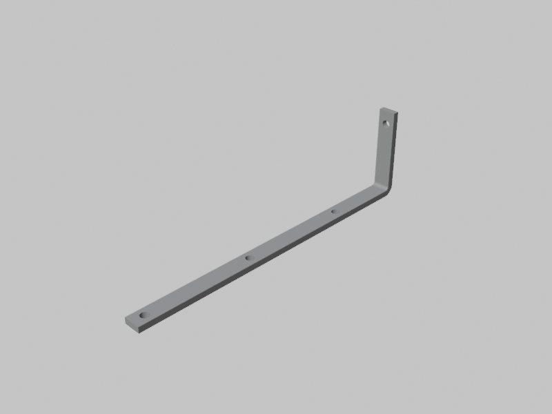
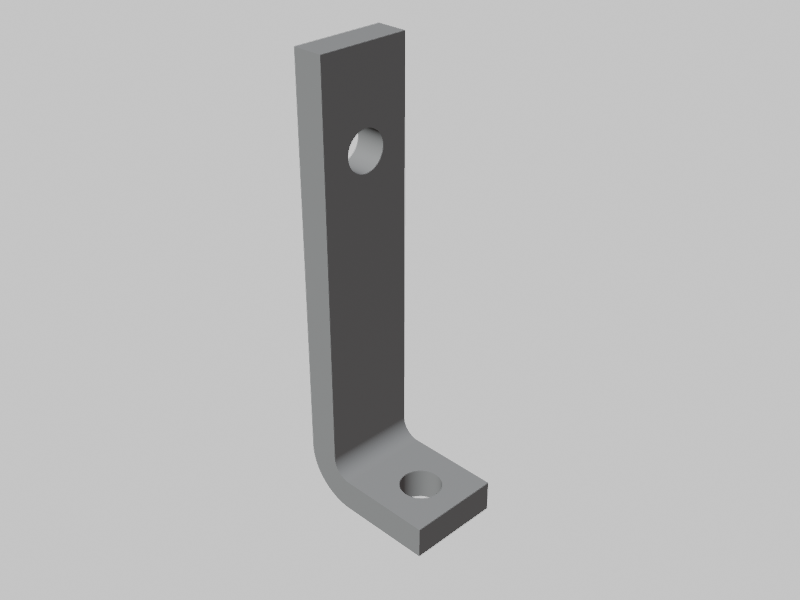
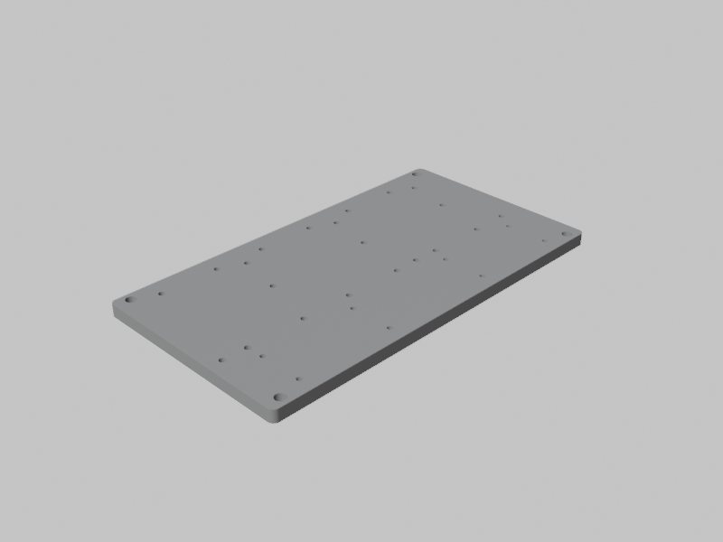
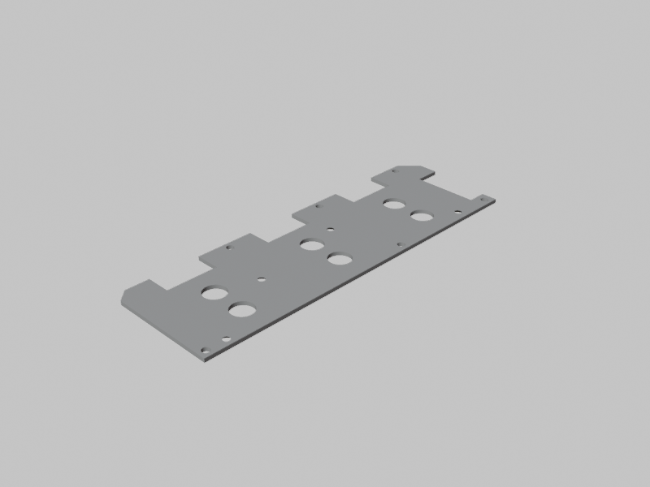

# Hardware BOM Pricing Report

Generated: 2026-07-17T20:42:54.392205Z

Base quantity: 2 unit(s)

---

## In-House Assembly

| Qty | Order | Internal P/N | Description | Part Number | Unit Price | Line Total | Source |
|-----|-------|--------------|-------------|-------------|------------|------------|--------|
| 2 |  | HW-C2-WH-TSBCM-A | CapacitorTempSenseHarness |  | N/A | N/A | manual |
| 8 |  | HW-C2-WH-CS-A | CurrentSenseHarness |  | N/A | N/A | manual |
| 2 |  | HW-C2-WH-GDVS-A | GDVSHarness |  | N/A | N/A | manual |
| 4 |  | HW-C2-WH-TSIGBT-A | TempSenseHarness |  | N/A | N/A | manual |

**In-House Assembly subtotal:** $0.00

## Digi-Key

| Qty | Order | Internal P/N | Description | Part Number | Unit Price | Line Total | Source |
|-----|-------|--------------|-------------|-------------|------------|------------|--------|
| 2 |  | HW-C2-HW-3M156058-ND-A | 3M156058-ND | 3M156058-ND | $46.9800 | $93.96 | digikey_cart_import |

**Digi-Key subtotal:** $93.96

## McMaster-Carr

| Qty | Order | Internal P/N | Description | Part Number | Unit Price | Line Total | Source |
|-----|-------|--------------|-------------|-------------|------------|------------|--------|
| 16 | 1 pack x 100 (left 84) | HW-C2-MECH-90128A232-A | 90128A232 | 90128A232 | $10.5500/pk | $10.55 | mcmaster_order_import |
| 10 | 1 pack x 50 (left 40) | HW-C2-MECH-90225A102-A | 90225A102 | 90225A102 | $12.8000/pk | $12.80 | mcmaster_order_import |
| 36 | 1 pack x 50 (left 14) | HW-C2-MECH-91292A134-A | 91292A134 | 91292A134 | $11.7200/pk | $11.72 | mcmaster_order_import |
| 8 | 1 pack x 50 (left 42) | HW-C2-MECH-91294A220-A | 91294A220 | 91294A220 | $12.7400/pk | $12.74 | mcmaster_order_import |
| 12 | 1 pack x 25 (left 13) | HW-C2-MECH-91502A180-A | 91502A180 | 91502A180 | $19.6500/pk | $19.65 | mcmaster_order_import |
| 12 | 2 pack x 10 (left 8) | HW-C2-MECH-91502A183-A | 91502A183 | 91502A183 | $17.2700/pk | $34.54 | mcmaster_order_import |
| 12 |  | HW-C2-MECH-94669A190-A | 94669A190 | 94669A190 | $1.3900 | $16.68 | mcmaster_order_import |
| 12 |  | HW-C2-MECH-94669A196-A | 94669A196 | 94669A196 | $2.9600 | $35.52 | mcmaster_order_import |
| 12 |  | HW-C2-MECH-94669A199-A | 94669A199 | 94669A199 | $3.1000 | $37.20 | mcmaster_order_import |
| 12 |  | HW-C2-MECH-94669A202-A | 94669A202 | 94669A202 | $3.2200 | $38.64 | mcmaster_order_import |
| 50 | 2 pack x 25 (left 0) | HW-C2-MECH-98044A224-A | 98044A224 | 98044A224 | $14.8800/pk | $29.76 | mcmaster_order_import |

**McMaster-Carr subtotal:** $259.80

## Mouser

| Qty | Order | Internal P/N | Description | Part Number | Unit Price | Line Total | Source |
|-----|-------|--------------|-------------|-------------|------------|------------|--------|
| 140 |  | HW-C2-CAP-100N-A | 100nF 100V | 80-C1210C104K1RAC | $0.1610 | $22.54 | mouser_cart_import |
| 42 |  | HW-C2-CAP-10N-A | 10nF 500V | 187-CL32B103KGFNNNE | $0.1430 | $6.01 | mouser_cart_import |
| 74 |  | HW-C2-CAP-10U-A | 10uF 25V | 187-CL32A106KAULNNE | $0.1340 | $9.92 | mouser_cart_import |
| 16 |  | HW-C2-CAP-1U-A | 1uf 50V | 187-CL32B105KBHNNNE | $0.2400 | $3.84 | mouser_cart_import |
| 4 |  | HW-C2-CAP-2U2-A | 2.2uf 1210 100v | 80-C1210C225J1RAUTO | $0.5200 | $2.08 | mouser_cart_import |
| 12 |  | HW-C2-CAP-220P-A | 220pF 100V C0G 1210 | 80-C1210C221J2G | $0.8800 | $10.56 | mouser_cart_import |
| 8 |  | HW-C2-CAP-22P-A | 22pF 50V | 80-C1210C220J5G | $0.7400 | $5.92 | mouser_cart_import |
| 4 |  | HW-C2-IC-8MHZ-A | 8mhz hc49-4h crystal | 710-830003156B | $0.5000 | $2.00 | mouser_cart_import |
| 2 |  | HW-C2-IC-CY15B102Q-SXET-A | CY15B102Q-SXET | 727-CY15B102Q-SXET | $18.1400 | $36.28 | mouser_cart_import |
| 8 |  | HW-C2-IC-ISO1042BDWVR-A | ISO1042BDWVR | 595-ISO1042BDWVR | $4.4400 | $35.52 | mouser_cart_import |
| 2 |  | HW-C2-IC-ISO1212DBQ-A | ISO1212DBQ | 595-ISO1212DBQ | $1.7300 | $3.46 | mouser_cart_import |
| 2 |  | HW-C2-IC-MAX22530AWE-A | MAX22530AWE+ | 700-MAX22530AWE+ | $15.6000 | $31.20 | mouser_cart_import |
| 12 |  | HW-C2-IC-NCV57100DWR2G-A | NCV57100DWR2G | 863-NCV57100DWR2G | $2.9800 | $35.76 | mouser_cart_import |
| 2 |  | HW-C2-IC-STM32G474RCT3-A | STM32G474RCT3 | 511-STM32G474RCT3 | $8.3100 | $16.62 | mouser_cart_import |
| 2 |  | HW-C2-IC-STM32H723ZGT6-A | STM32H723ZGT6 | 511-STM32H723ZGT6 | $13.2500 | $26.50 | mouser_cart_import |
| 2 |  | HW-C2-CONN-SSW-110-01-F-D-A | SSW-110-01-F-D | 200-SSW11001FD | $2.4100 | $4.82 | mouser_cart_import |
| 2 |  | HW-C2-CONN-TSW-110-21-L-D-LL-A | TSW-110-21-L-D-LL | 200-TSW11021LDLL | $2.2700 | $4.54 | mouser_cart_import |
| 16 |  | HW-C2-HW-0022011042-A | 0022011042 |  | N/A | N/A | manual |
| 64 |  | HW-C2-HW-08-50-0113-A | 08-50-0113 |  | N/A | N/A | manual |
| 8 |  | HW-C2-HW-22-04-1041-A | 22-04-1041 | 538-22-04-1041 | $0.8900 | $7.12 | mouser_cart_import |
| 6 |  | HW-C2-HW-455-2266-ND-A | 455-2266-ND | 306-XHP-2 | $0.1000 | $0.60 | mouser_cart_import |
| 50 |  | HW-C2-HW-464762-E-A | 464762-E | 305-464762 | $0.3970 | $19.85 | mouser_cart_import |
| 10 |  | HW-C2-HW-524265-E-A | 524265-E | 305-524265-E | $7.8700 | $78.70 | mouser_cart_import |
| 10 |  | HW-C2-HW-544959-E-A | 544959-E |  | N/A | N/A | manual |
| 2 |  | HW-C2-HW-776231-1-A | 776231-1 | 571-776231-1 | $16.6900 | $33.38 | mouser_cart_import |
| 16 |  | HW-C2-HW-971150581-A | 971150581 | 710-971150581 | $0.6000 | $9.60 | mouser_cart_import |
| 16 |  | HW-C2-HW-971250581-A | 971250581 | 710-971250581 | $1.1000 | $17.60 | mouser_cart_import |
| 16 |  | HW-C2-HW-971350581-A | 971350581 | 710-971350581 | $1.4800 | $23.68 | mouser_cart_import |
| 16 |  | HW-C2-HW-9774030592R-A | 9774030592R | 710-9774030592R | $1.5700 | $25.12 | mouser_cart_import |
| 4 |  | HW-C2-HW-ACT45B-101-2P-TL003-A | ACT45B-101-2P-TL003 | 810-ACT45B1012PTL003 | $1.5300 | $6.12 | mouser_cart_import |
| 4 |  | HW-C2-HW-AWHSH105D00G-A | AWHSH105D00G | 523-AWHSH105D00G | $1.1100 | $4.44 | mouser_cart_import |
| 6 |  | HW-C2-HW-B2B-XH-AM_LF__SN_-A | B2B-XH-AM_LF__SN_ | 306-B2B-XH-AMLFSNP | $0.1000 | $0.60 | mouser_cart_import |
| 24 |  | HW-C2-HW-B58031U9254M062-A | B58031U9254M062 | 871-B58031U9254M062 | $4.6500 | $111.60 | mouser_cart_import |
| 24 |  | HW-C2-HW-BAT54WS-7-F-A | BAT54WS-7-F | 621-BAT54WS-F | $0.1240 | $2.98 | mouser_cart_import |
| 10 |  | HW-C2-HW-BTS462TATMA1-A | BTS462TATMA1 | 726-BTS462TATMA1 | $2.6600 | $26.60 | mouser_cart_import |
| 6 |  | HW-C2-HW-CM600DY-24T-A | CM600DY-24T | CM600DY-24T | $323.5000 | $1941.00 | mouser_cart_import |
| 2 |  | HW-C2-HW-DRDNB21D-7-A | DRDNB21D-7 | 621-DRDNB21D-7 | $0.5600 | $1.12 | mouser_cart_import |
| 2 |  | HW-C2-HW-EC7BW-110S12-A | EC7BW-110S12 | 418-EC7BW-110S12 | $48.8600 | $97.72 | mouser_cart_import |
| 24 |  | HW-C2-HW-FDFNYD1-110-5-A | FDFNYD1-110(5) | 161-FDFNYD1-1105 | $0.4800 | $11.52 | mouser_cart_import |
| 8 |  | HW-C2-HW-LA37S600S05KM-A | LA37S600S05KM | 838-LA37S600S05KM | $19.9600 | $159.68 | mouser_cart_import |
| 2 |  | HW-C2-HW-LT3080IQ-PBF-A | LT3080IQ#PBF | 584-LT3080IQ#PBF | $8.5400 | $17.08 | mouser_cart_import |
| 4 |  | HW-C2-HW-LTST-C230CKT-A | LTST-C230CKT | 859-LTST-C230CKT | $0.4100 | $1.64 | mouser_cart_import |
| 4 |  | HW-C2-HW-LTST-C230GKT-A | LTST-C230GKT | 859-LTST-C230GKT | $0.3600 | $1.44 | mouser_cart_import |
| 2 |  | HW-C2-HW-MF-RHT200_32-2-A | MF-RHT200_32-2 | 652-MF-RHT200/32-2 | $0.6100 | $1.22 | mouser_cart_import |
| 12 |  | HW-C2-HW-MGJ2D121509MPC-R7-A | MGJ2D121509MPC-R7 | 580-MGJ2D121509MPCR7 | $6.7700 | $81.24 | mouser_cart_import |
| 12 |  | HW-C2-HW-MKP1848S61010JY5B-A | MKP1848S61010JY5B | 75-MKP1848S61010JY5B | $7.5400 | $90.48 | mouser_cart_import |
| 10 |  | HW-C2-HW-MM3Z3V0ST1G-A | MM3Z3V0ST1G | 863-MM3Z3V0ST1G | $0.1700 | $1.70 | mouser_cart_import |
| 2 |  | HW-C2-HW-NXFT15XH103FEAB021-A | NXFT15XH103FEAB021 | 81-NXFT15XH103FEAB21 | $0.3400 | $0.68 | mouser_cart_import |
| 2 |  | HW-C2-HW-RD7-12S033R-A | RD7-12S033R | 737-RD7-12S033R | $6.7700 | $13.54 | mouser_cart_import |
| 6 |  | HW-C2-HW-RKE-1205S_H-A | RKE-1205S_H | 919-RKE-1205S/H | $5.1700 | $31.02 | mouser_cart_import |
| 4 |  | HW-C2-HW-RTS103C1R2M6L201-A | RTS103C1R2M6L201 | 527-RTS103C1R2M6L201 | $2.2700 | $9.08 | mouser_cart_import |
| 4 |  | HW-C2-HW-S3N-A | S3N | 512-S3N | $0.6700 | $2.68 | mouser_cart_import |
| 4 |  | HW-C2-HW-SSW-103-01-L-D-A | SSW-103-01-L-D | 200-SSW10301LD | $1.3400 | $5.36 | mouser_cart_import |
| 2 |  | HW-C2-HW-SSW-104-01-L-D-A | SSW-104-01-L-D | 200-SSW10401LD | $1.6900 | $3.38 | mouser_cart_import |
| 4 |  | HW-C2-HW-SSW-108-01-L-D-A | SSW-108-01-L-D | 200-SSW10801LD | $2.3500 | $9.40 | mouser_cart_import |
| 2 |  | HW-C2-HW-SSW-110-01-F-D-A | SSW-110-01-F-D |  | N/A | N/A | manual |
| 2 |  | HW-C2-HW-STS41A-AWLB-R3-A | STS41A-AWLB-R3 | 403-STS41A-AWLB-R3 | $1.1300 | $2.26 | mouser_cart_import |
| 12 |  | HW-C2-HW-STTH112A-A | STTH112A | 511-STTH112A | $0.5900 | $7.08 | mouser_cart_import |
| 12 |  | HW-C2-HW-SXH-001T-P0-6-A | SXH-001T-P0.6 | 306-SXH-001T-P0.6 | $0.1000 | $1.20 | mouser_cart_import |
| 8 |  | HW-C2-HW-SZMMSZ4678T1G-A | SZMMSZ4678T1G | 863-SZMMSZ4678T1G | $0.4300 | $3.44 | mouser_cart_import |
| 42 |  | HW-C2-HW-TESTPOINT-TH-RED-A | Testpoint TH, RED | 534-5000 | $0.2930 | $12.31 | mouser_cart_import |
| 2 |  | HW-C2-HW-TPS389006ADJRTER-A | TPS389006ADJRTER | 595-TPS389006ADJRTER | $5.1000 | $10.20 | mouser_cart_import |
| 4 |  | HW-C2-HW-TS40-66-50-R-260-SMT-TR-A | TS40-66-50-R-260-SMT-TR | 179-TS406650R260S | $0.4800 | $1.92 | mouser_cart_import |
| 4 |  | HW-C2-HW-TSW-103-18-G-D-A | TSW-103-18-G-D | 200-TSW10318GD | $1.0100 | $4.04 | mouser_cart_import |
| 4 |  | HW-C2-HW-TSW-108-18-F-D-A | TSW-108-18-F-D | 200-TSW10818FD | $1.4500 | $5.80 | mouser_cart_import |
| 2 |  | HW-C2-HW-TSW-110-18-T-D-A | TSW-110-18-T-D | 200-TSW11018TD | $1.5800 | $3.16 | mouser_cart_import |
| 26 |  | HW-C2-HW-UCM1H101MCL1GS-A | UCM1H101MCL1GS | 647-UCM1H101MCL1GS | $0.3250 | $8.45 | mouser_cart_import |
| 120 |  | HW-C2-HW-UCS2D331MHD-A | UCS2D331MHD | 647-UCS2D331MHD | $2.1600 | $259.20 | mouser_cart_import |
| 2 |  | HW-C2-HW-UJ2-B-HR-G-V-A | UJ2-B-HR-G-V | 179-UJ2-B-HR-G-V | $1.7000 | $3.40 | mouser_cart_import |
| 36 |  | HW-C2-HW-VY1222M47Y5UQ6TV0-A | VY1222M47Y5UQ6TV0 | 72-VY1222M47Y5UQ6TV0 | $0.2710 | $9.76 | mouser_cart_import |
| 54 |  | HW-C2-RES-10K-A | 10k 1210 | 603-AC1210JR-0710KL | $0.0500 | $2.70 | mouser_cart_import |
| 8 |  | HW-C2-RES-120-A | 120 1210 | 603-AC1210FR-07120RL | $0.1000 | $0.80 | mouser_cart_import |
| 34 |  | HW-C2-RES-1K-A | 1k 1210 | 603-RC1210FR-071KL | $0.0490 | $1.67 | mouser_cart_import |
| 24 |  | HW-C2-RES-2R7-A | 2.7 ohm 1210 | 667-ERJ-14BQF2R7U | $0.2340 | $5.62 | mouser_cart_import |
| 32 |  | HW-C2-RES-20K-A | 20k 1210 resistor | 667-ERJ-P14F2002U | $0.2450 | $7.84 | mouser_cart_import |
| 2 |  | HW-C2-RES-220-A | 220 1210 | 603-RC1210FR-07220RL | $0.1000 | $0.20 | mouser_cart_import |
| 6 |  | HW-C2-RES-3K-A | 3k 1210 1% | 603-RC1210FR-073KL | $0.1000 | $0.60 | mouser_cart_import |
| 6 |  | HW-C2-RES-4K7-A | 4.7k 1210 | 71-CRCW12104K70FKEAH | $0.5900 | $3.54 | mouser_cart_import |
| 2 |  | HW-C2-RES-499K-A | 499kohm 1210 resistor | 667-ERJ-P14F4993U | $0.4400 | $0.88 | mouser_cart_import |
| 4 |  | HW-C2-RES-560-A | 560ohm 1210 resistor | 667-ERJ-P14F5600U | $0.4400 | $1.76 | mouser_cart_import |
| 32 |  | HW-C2-RES-250K-A | Thick Film Resistors - SMD 1/2watt 249Kohms 1% | 71-CRCW1210-249K-E3 | $0.0700 | $2.24 | mouser_cart_import |

**Mouser subtotal:** $3466.58

## PCB Fabrication

| Qty | Order | Internal P/N | Description | Part Number | Unit Price | Line Total | Source |
|-----|-------|--------------|-------------|-------------|------------|------------|--------|
| 2 |  | HW-C2-PCB-CTRL-A | ControlBoard | ControlBoard | $25.2400 | $50.48 | jlcpcb_order_import |
| 2 |  | HW-C2-PCB-DCBUSCAP-A | DCBusCapacitorBoard | DCBusCapacitorBoard | $7.5400 | $15.08 | jlcpcb_order_import |
| 2 |  | HW-C2-PCB-DCFLT-A | DCBusFilter | DCBusFilter | $8.4400 | $16.88 | jlcpcb_order_import |
| 2 |  | HW-C2-PCB-GD-A | GateDriver | GateDriver | $11.6600 | $23.32 | jlcpcb_order_import |
| 2 |  | HW-C2-PCB-IO-A | IOBoard | IOBoard | $11.6600 | $23.32 | jlcpcb_order_import |

**PCB Fabrication subtotal:** $129.08

## SendCutSend

| Qty | Order | Internal P/N | Description | Part Number | Unit Price | Line Total | Source |
|-----|-------|--------------|-------------|-------------|------------|------------|--------|
| 4 |  | HW-C2-BB-DCLBB-A | HW-C2-DCLBB-A | HW-C2-DCLBB-A | $45.1200 | $180.48 | sendcutsend_folder |
| 6 |  | HW-C2-BB-PBB-A | HW-C2-PBB-A | HW-C2-PBB-A | $17.0300 | $102.18 | sendcutsend_folder |
| 2 |  | HW-C2-PLT-BSP-A | HW-C2-BSP-A | HW-C2-BSP-A | $144.4600 | $288.92 | sendcutsend_folder |
| 2 |  | HW-C2-PLT-CHSP-A | HW-C2-CHSP-A | HW-C2-CHSP-A | $24.6700 | $49.34 | sendcutsend_folder |

**SendCutSend subtotal:** $620.92

---

## Grand Total (2 units): **$4570.34**

## Quantity Scaling

| Quantity | Estimated Total |
|----------|----------------|
| 1 | $2318.90 |
| 2 | $4570.34 |
| 3 | $6816.23 |
| 5 | $11321.50 |
| 10 | $22587.25 |

## Pack Rounding & Stock

| Part | Need | On Hand | Order | Leftover |
|------|------|---------|-------|----------|
| 90128A232 | 16 | - | 1 pack x 100 | 84 |
| 90225A102 | 10 | - | 1 pack x 50 | 40 |
| 91292A134 | 36 | - | 1 pack x 50 | 14 |
| 91294A220 | 8 | - | 1 pack x 50 | 42 |
| 91502A180 | 12 | - | 1 pack x 25 | 13 |
| 91502A183 | 12 | - | 2 pack x 10 | 8 |
| 98044A224 | 50 | - | 2 pack x 25 | 0 |

## Unknown / Missing Prices

- CapacitorTempSenseHarness (assembly)
- CurrentSenseHarness (assembly)
- GDVSHarness (assembly)
- TempSenseHarness (assembly)
- 0022011042 (mouser)
- 08-50-0113 (mouser)
- 544959-E (mouser)
- SSW-110-01-F-D (mouser)

## SendCutSend Part Details

### HW-C2-DCLBB-A

- **Qty (per unit):** 2
- **Material:** Copper
- **Thickness:** 4.75 mm
- **Finish:** Bending
- **Unit Price:** $45.12
- **STEP:** `../Mechanical/Fab/HW-C2-DCLBB-A/HW-C2-DCLBB-A.step`

### HW-C2-PBB-A

- **Qty (per unit):** 3
- **Material:** Copper
- **Thickness:** 4.75 mm
- **Finish:** Bending
- **Unit Price:** $17.03
- **STEP:** `../Mechanical/Fab/HW-C2-PBB-A/HW-C2-PBB-A.step`

### HW-C2-BSP-A

- **Qty (per unit):** 1
- **Material:** 6061 T6 Aluminum
- **Thickness:** 9.52 mm
- **Finish:** Deburring, Tapping
- **Unit Price:** $144.46
- **STEP:** `../Mechanical/Fab/HW-C2-BSP-A/C2-HW-BSP-A.step`

### HW-C2-CHSP-A

- **Qty (per unit):** 1
- **Material:** 6061 T6 Aluminum
- **Thickness:** 3.17 mm
- **Finish:** Deburring
- **Unit Price:** $24.67
- **STEP:** `../Mechanical/Fab/HW-C2-CHSP-A/HW-C2-CHSP-A.step`

## Fabrication Package

| PCB Board | Fab Files | Zip | Fab Price |
|-----------|-----------|-----|-----------|
| ControlBoard | 32 | built | $25.24 |
| DCBusCapacitorBoard | 26 | built | $7.54 |
| DCBusFilter | 28 | built | $8.44 |
| GateDriver | 30 | built | $11.66 |
| IOBoard | 30 | built | $11.66 |

| Fab Part | Rev | Qty | STEP | info.txt | Price | Spec |
|----------|-----|-----|------|----------|-------|------|
| HW-C2-BSP-A | A | 1 | yes | yes | $144.46 | 6061 T6 Aluminum / 9.52 mm / Sheet Cutting / Deburring, Tapping |
| HW-C2-CHSP-A | A | 1 | yes | yes | $24.67 | 6061 T6 Aluminum / 3.17 mm / Sheet Cutting / Deburring |
| HW-C2-DCLBB-A | A | 2 | yes | yes | $45.12 | Copper / 4.75 mm / Sheet Cutting / Bending |
| HW-C2-PBB-A | A | 3 | yes | yes | $17.03 | Copper / 4.75 mm / Sheet Cutting / Bending |

| Harness | Qty/Chassis | Rev | BOM CSV |
|---------|-------------|-----|---------|
| CapacitorTempSenseHarness | 1 | A | yes |
| CurrentSenseHarness | 4 | A | yes |
| GDVSHarness | 1 | A | yes |
| TempSenseHarness | 2 | A | yes |

