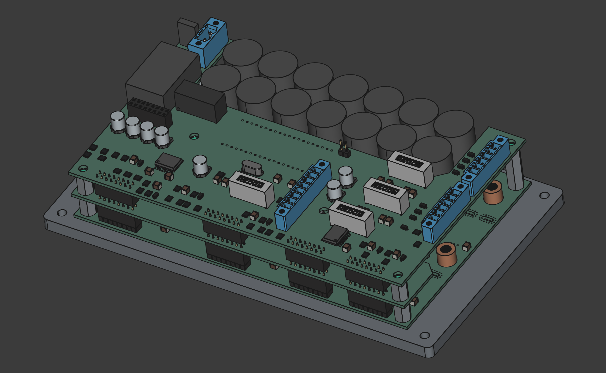

# Open Source Traction Inverter & VCU

A high-power, open-source motor inverter and vehicle control unit for 3-phase PMSM traction motors. Rated for up to 100 kW peak, 150&ndash;800 A phase current, with DC bus up to 800 V capable (tested to 200 V). The design is applicable to any traction system requiring field-oriented motor control with robust functional safety architecture.

Developed at the **Corzine Lab, University of California, Santa Cruz** by Thomas Liao. The design is modular, with common firmware, control architecture, and communication interfaces shared across applications. All hardware and software are released under open-source licenses.

## Hardware Architecture

### Power Stage
- **3-phase 2-level IGBT bridge** with six discrete IGBT modules
- **Phase current**: 150 A &ndash; 800 A continuous (peak capability dependent on thermal management)
- **DC bus voltage**: Up to 800 V capable; tested to 200 V (DC link capacitor limited)
- **Gate drivers**: Six onsemi NCV57001 isolated IGBT gate drivers
  - Reinforced isolation: >5 kVrms (UL1577), 1200 V working voltage
  - Internal DESAT short-circuit detection with <2 us shutdown
  - Complementary IN+/IN&minus; inputs for anti-shoot-through
  - Active Miller clamp and soft turn-off
  - Active pull-down to 0 V during fault/UVLO conditions
- **Gate drive power**: Six Murata MGJ2D121509MPC-R7 isolated DC/DC converters
  - 12 V input &rarr; isolated +15 V / &minus;9 V bipolar output per gate driver
  - Each supply fully isolated from logic and from each other
  - PMIC enable input per supply for controlled shutdown
  - Gate driver power kill: STM32 PMIC EN = low disables all six MGJ2D121509MPC-R7 supplies simultaneously, forcing all IGBT gates to 0 V via NCV57001 active pull-down

### Current Sensing
- **Four Tamura LA37S hall-effect current transducers** (3 phase + DC link)
  - &plusmn;1200 A sensing range, centered at 2.5 V output
  - Separate reference signal per sensor for fault detection
  - ~300 mA effective measurement accuracy (with 16-bit STM32 ADC and scaled input conditioning)
  - Analog ground kept separate and bonded at the STM32 for noise reduction

### Voltage Sensing
- **MAX22530AWE+ 12-bit isolated ADC** with 4 channels
  - Measures DC bus voltage and all three phase voltages (U, V, W)
  - ~&plusmn;1 V measurement accuracy
  - SPI interface to STM32 with reinforced isolation

### Communication
- **Dual isolated CAN bus**: ISO1042 isolated CAN transceivers
  - CAN1: Battery Management System (BMS)
  - CAN2: ABS module, display/dash, charger(s), IO board (brake, kickstand, turn signals)
- **BMS heartbeat**: 5-second timeout (BMS external to this system)
- **IO board heartbeat**: 1-second timeout

### Control Electronics — Dual-MCU Architecture
- **STM32H723ZG** main MCU (550 MHz Cortex-M7)
  - ECC-protected RAM, 1 MB flash
  - FDCAN1 + FDCAN2, HRTIM, 16-bit ADC
  - Runs FOC motor control, sensor acquisition, CAN communication, safe state management
  - GATE_DRIVE_PWR1_ENABLE — gate drive power kill Path 2a
- **STM32G474RCTx** safety coprocessor (170 MHz Cortex-M4+FPU)
  - Independent 3.3 V supply, 8 MHz crystal
  - FDCAN2 + FDCAN3 (independent CAN bus snooping)
  - Independent ADC access to all current sensors, temperatures, encoder, gate drive feedback
  - Monitors all 6 PWM output pairs (high/low) for deadtime violations, stuck-on, stuck-off
  - GATE_DRIVE_PWR2_ENABLE — gate drive power kill Path 2b (1oo2 with main MCU)
  - Challenge-response watchdog with main MCU via inter-MCU UART
  - Bidirectional NRST — can reset main MCU; main MCU can reset coprocessor
  - CY15B102Q-SXET 256 KB FRAM for fault logs, configuration, hour meter, odometer
- **Onboard power**: Cincon EC7BW-110S12 railway-grade DC/DC
  - 40&ndash;160 V input (4:1), 12 V / 1.67 A output
  - EN 50155 qualified, 1500 V I/O isolation
- **Fail-safe default**: Six-switch-open (SSO) &mdash; all IGBTs off

### Throttle Input
- Dual redundant 5 k&Omega; potentiometers + end-travel limit switch
- 0&ndash;5 V output scaled to 0&ndash;3.3 V via precision resistor dividers
- Both MCUs read throttle independently; discrepancy &gt;5% triggers safe state

### Safe State Entry — Six Redundant SSO Pathways
1. **TIM1_BKIN hardware** (&lt;100 ns) — OR'd gate driver FLT &rarr; hardware clears MOE, all PWM disabled
2. **GATE_DRIVE_PWR1_ENABLE** (~10 us, main MCU) — main deasserts &rarr; gate drive UVLO &rarr; pull-down &rarr; SSO. Feedback: GATE_DRIVE_PWR1_FB
3. **GATE_DRIVE_PWR2_ENABLE** (~10 us, coprocessor) — coprocessor deasserts &rarr; same UVLO path. Independent of Path 2. Feedback: GATE_DRIVE_PWR2_FB. Either Path 2 or 3 alone achieves SSO (1oo2)
4. **GATE_DRIVE_RESET** (&lt;1 us, either MCU) — either asserts RESET &rarr; all NCV57001 soft turn-off &rarr; SSO
5. **Coprocessor watchdog &rarr; NRST** (~100 ms) — challenge/response failure &rarr; coprocessor resets main MCU &rarr; SSO during boot
6. **Coprocessor independent fault trigger** (&lt;10 us) — coprocessor detects critical fault &rarr; GATE_DRIVE_PWR2_ENABLE low + RESET &rarr; SSO without main MCU

### Safety Protections (Hardware + Dual-MCU)
- Hardware PWM disable via TIM1_BKIN (&lt;100 ns)
- NCV57001 DESAT short-circuit protection (&lt;2 us)
- 1oo2 gate drive power kill with independent feedback (GATE_DRIVE_PWR1_FB, GATE_DRIVE_PWR2_FB)
- Dual independent watchdog timers (main MCU windowed WDT + coprocessor challenge/response)
- HVIL (High-Voltage Interlock Loop) monitoring
- All six NCV57001 FLT outputs OR'd — monitored by **both** MCUs
- Overcurrent detection: dual-MCU integrated monitoring, 100 ms response — sufficient for safe torque off without hardware damage (DESAT handles hard shorts &lt;2 us)
- **ASIL D via ASIL B(D) + ASIL B(D) decomposition**

> **Note on Overcurrent Protection:** The schematic includes LM397 comparators for phase and DC link overcurrent detection, but these are not required for the safety case. Hard short-circuits are handled by NCV57001 DESAT (&lt;2 us). Regular overcurrent (non-DESAT) is detected within **100 ms** by dual-MCU integrated monitoring — both the STM32H723 and STM32G474 independently sample all current channels at high rate. Either MCU detecting overcurrent triggers SSO via its independent gate drive power kill. This 100 ms detection is faster than the IGBT thermal time constant and cannot cause permanent damage. The LM397s are retained as a non-safety redundant monitoring layer.

## Motor Control

Field-Oriented Control (FOC) running at PWM switching frequency with the following modulation strategies:
- **SPWM** &mdash; Sinusoidal Pulse Width Modulation
- **SVPWM** &mdash; Space Vector Modulation
- **ARSVPWM** &mdash; Alternating Reverse Sequence Vector PWM
- **SHEPWM** &mdash; Selective Harmonic Elimination
- **RCFM** &mdash; Random Carrier Frequency Modulation
- **RSPWM** &mdash; Random Sinusoidal PWM
- **N-Pulse / N-Pulse Wide / N-Pulse Custom** &mdash; Low pulse-count for high-speed operation
- **RSVM** &mdash; Random Space Vector Modulation

Modulation schemes can be switched live via CAN bus. Automatic selection based on speed/torque operating region with configurable hysteresis to prevent boundary jitter. Bumpless crossfade with di/dt gating during regen/acceleration transitions. All configurable via the Real Time Examiner (RTE) interface tool.

## Functional Safety

A Hazard Analysis and Risk Assessment (HARA) with comprehensive Fault Injection Test Plan has been conducted in accordance with ISO 26262 methodology. The analysis identifies hazardous events, assigns ASIL ratings, derives Safety Goals and Functional Safety Requirements, and defines 71 fault injection tests across four categories. A separate Threat Analysis and Risk Assessment (TARA) covers cybersecurity with an open-source trust model.

- **`Docs/HARA.pdf`** (108 pages, v4.0) &mdash; Unified HARA and Fault Injection Test Plan covering:
  - 18 identified hazards including loss of tractive effort mid-corner (H-03a)
  - 15 Safety Goals (ASIL A through D) — ASIL D achievable via dual-MCU ASIL B(D) decomposition
  - 21 Functional Safety Requirements
  - Gap analysis with priority-ranked mitigations — GAP-HW-01 (HW OCP) closed, dual-MCU monitoring sufficient
  - 75 fault injection tests across component (50), system (14), integration (11), and environmental (12) levels
  - Six redundant SSO pathways (was three) with 1oo2 gate drive power kill
  - Complete traceability and coverage justification
  - Test execution order with progressive validation and hardware damage risk classification
  - STM32G474RCTx coprocessor fully integrated — not a future enhancement

- **`Docs/TARA.pdf`** (19 pages) &mdash; Threat Analysis and Risk Assessment per ISO/SAE 21434:
  - 7 threat scenarios covering CAN bus attack surface
  - 7 Cybersecurity Requirements (CSRs) with HMAC-SHA256 firmware signing
  - 8 cybersecurity test cases
  - <strong>User sovereignty model:</strong> explicit rejection of anti-user OTP/DRM; no vendor lock-in; user-managed keys
  - Security model: <strong>trust the user, protect the bus</strong> — legitimate owner is never the threat
  - User can add their own tamper protection (RDP, encrypted flash) if desired
  - Cross-referenced to HARA for safety-relevant threats

- **`Docs/SWAD.pdf`** (45 pages, v1.3) &mdash; Software Architecture Document:
  - 4-layer architecture: user-configurable, safe, reliable; dual-MCU with ASIL B(D) decomposition
  - FOC + multi-modulation (SPWM, SVPWM, ARSVPWM, SHEPWM, N-Pulse/Wide/Custom, RSVM, RCFM)
  - <strong>FOC runs at PWM switching frequency</strong> (TIM1_UP, 300 Hz - 16 kHz); ADC oversampled at n&times; PWM freq up to 48 kSPS
  - Bumpless modulation scheme transitions with crossfade; async/sync boundary auto-handled
  - 50 kHz effective current sense bandwidth via sinc3 decimation; 16-bit ADC1 + 12-bit ADC2/ADC3
  - Current sensor validation: VREF 2.48&ndash;2.50&ndash;2.52V; zero-point &plusmn;20%; 0-3.3V; DC-link back-calc
  - Real-time loss estimator + thermal model; die temp estimation; time-to-overtemperature prediction
  - 1oo3 temp voting (highest wins); one NTC per IGBT module; 100&deg;C hard cap
  - CY15B102Q-SXET 256 KB FRAM on coprocessor for logs/config/hour/odo; hardware WP
  - 1oo2 gate drive power kill (GATE_DRIVE_PWR1_ENABLE + GATE_DRIVE_PWR2_ENABLE) with independent feedback
  - Six SSO pathways; inter-MCU challenge/response watchdog; bidirectional NRST
  - Input validation framework (3 layers); FW update via UART/USB or CAN
  - 6-state SM with full transition table; RTE config tool
  - Motor, encoder, BMS, IO board, charger, display are <strong>out of scope</strong> (external products)
  - 42 tables; all 21 FSRs traced

- **`Docs/Traction_Inverter_User_Manual.pdf`** (26 pages, v2.2) &mdash; User Manual:
  - Complete electrical interface and integration guide for 140V/600A variant
  - Ampseal 35-pin connector pinout with numbered pins 1-35 (9 functional groups)
  - HVIL: inverter signals presence, <strong>BMS/external system controls main contactor</strong>
  - Precharge: <strong>high-side relay</strong>, isolated +12V; main contactor is external (not inverter)
  - Power supply architecture: logic power, switched +12V, isolated gate drive/sensor rails
  - Gate drive: +15V/-9V, DESAT, Miller clamp, FLT feedback, supply kill
  - Position sensor: <strong>sin/cos encoder or Hall effect only</strong> (quadrature/resolver not supported)
  - Sensing: 16-bit ADC current, MAX22530 voltage, NTC temperature
  - IGBT: 1200V standard, 600V optional on request
  - Dual isolated CAN bus assignment; CAN protocol reference (user-configurable)
  - USB-B debug port, MCP2221A UART bridge, firmware update
  - No warranty; use at own risk; parasitic drain note (no hardware sleep pin)
  - Safety callouts: HV warnings, one clean Sevcon incompatibility warning, RDP warning, debug cautions

**Important:** ASIL ratings are targets derived from the HARA process, not compliance claims. The dual-MCU architecture (STM32H723 + STM32G474 coprocessor) enables ASIL D for SG-01 and SG-13 via ASIL B(D) + ASIL B(D) decomposition. No formal ISO 26262 compliance audit has been performed. A Dependent Failure Analysis (DFA) per ISO 26262-9 is required before formal ASIL D claims can be substantiated — this is documented as the remaining P0 gap (LIMIT-08). This is a design-for-safety effort. Security follows a <strong>user sovereignty</strong> model: the project explicitly rejects anti-user OTP/DRM measures (no vendor lock-in, no encrypted bootloaders with unreplaceable keys). Protections target remote CAN bus attacks, not the legitimate hardware owner. Physical access = user is root.

## Project Status

### Hardware
| Milestone | Status |
|---|---|
| Main inverter schematic and PCB design | Complete |
| STM32 prototype assembly | Complete, under active test |
| Full-load dyno testing | Planned |
| Environmental and thermal validation | Planned |

### Software/Firmware
| Milestone | Status |
|---|---|
| Real Time Examiner (RTE) host tool | In development |
| STM32 low-level drivers (ADC, PWM, CAN, GPIO) | Implemented and tested |
| Communication protocol | Implemented |
| Sensor acquisition and filtering | Implemented |
| Field-Oriented Control (FOC) | In development |
| Torque command processing and safety limits | Architecture defined, implementation in progress |
| Fault handling and safe state management | Architecture defined, implementation in progress |
| Power-on self-test (POST) | Architecture defined |

### Safety Analysis
| Deliverable | Status |
|---|---|
| HARA &mdash; Unified (Rev. 3.0) | Complete |
| TARA &mdash; Threat Analysis (Rev. 1.1, anti-OTP/user-sovereignty) | Complete |
| SWAD &mdash; Software Architecture (Rev. 1.3, dual-MCU update pending) | Complete |
| Technical Safety Concept | Not started |
| Component-level FMEA | Not started |
| Fault injection test plan | Complete (71 tests defined) |

## Getting Started

### For Users

The BOM, Gerbers, and manufacturing files are in the `Size2/` directory. Assembly is recommended for experienced builders only. This design involves high voltages (up to 800 V DC capable, tested to 200 V) and currents (up to 800 A) that can be lethal. Proper safety equipment and procedures are mandatory.

**Prerequisites:**
- Compatible HV battery pack (48&ndash;800 V capable; tested to 200 V)
- 3-phase PMSM motor with encoder/resolver feedback
- Compatible BMS with CAN communication
- 12 V auxiliary supply (or self-powered via onboard DC/DC)
- RTE host tool (or direct CAN interface) for configuration

### For Contributors

Contributions are welcome. This project uses **KiCad** for schematic and PCB design, **FreeCAD** for mechanical design, and **STM32CubeIDE / GCC ARM** for firmware.

When contributing:
- Maintain consistency with existing design conventions
- Include schematics, PCB layouts, BOMs, and documentation
- Reference relevant Safety Goals when modifying safety-critical code or hardware
- Update the HARA if your change affects hazard controls

## License

Hardware designs are released under the **CERN Open Hardware Licence**.

Firmware and software are released under the **MIT License**.

Safety documentation is provided for reference and design guidance purposes.

## Sponsors

A special thank you to our sponsors, **[Mouser Electronics](https://mouser.com)**, **[Mitsubishi Electric](https://www.mitsubishielectric.com/semiconductors/powerdevices/)**, and **[SendCutSend](https://sendcutsend.com/)**! Their support has been invaluable for making this project possible.

---

*This project involves high voltages and currents that can cause serious injury or death. Do not attempt to build, test, or operate this equipment without proper training, safety equipment, and procedures. The authors and contributors accept no liability for any injury, damage, or loss resulting from the use of this design.*
