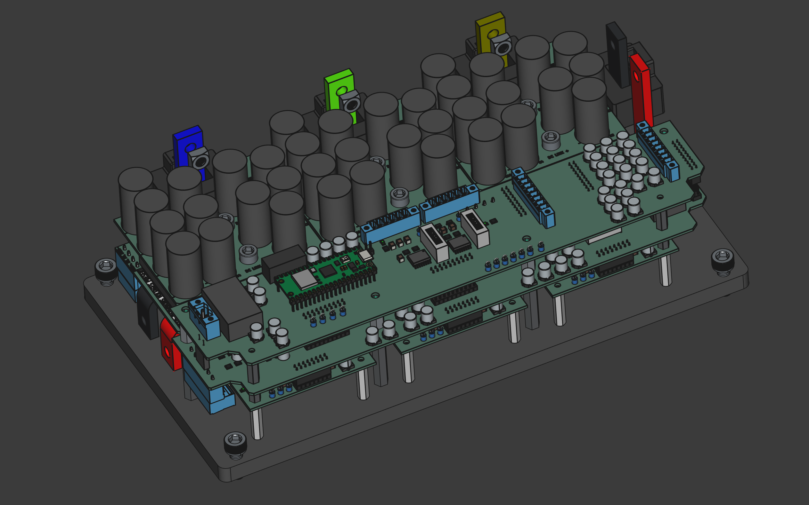

# OpenVVVF Hardware

> This repository contains the **OpenVVVF Hardware** designs and documentation. The matching firmware, Real Time Examiner (RTE) host tool, and supporting configuration utilities (including node codegen and telemetry tooling) now live in [OpenVVVF/RTE](https://github.com/OpenVVVF/RTE).

An open-source, high-power voltage-source inverter (VSI) for 3-phase AC drives. The design centres on a dual-MCU control board with an independent safety coprocessor, fully isolated gate drives and sensing, dual isolated CAN buses, and a control stack configurable through node-based codegen tools.

The present hardware implementation (Chassis Size 2) is a 140 V nominal / 600 A build. The platform is designed to scale across a wide range of voltage and current classes — up to 450 V with a capacitor-only swap and 900 V with a DC link PCB + capacitor change — with appropriate gate-driver and sensing-divider adaptations.

This project is currently being developed in Dr. Keith Corzine's Smart Power Lab at the University of California, Santa Cruz.

The hardware designs are modular and share a common control architecture and communication interfaces with the firmware in [OpenVVVF/RTE](https://github.com/OpenVVVF/RTE). All hardware and software are released under open-source licenses.

## Platform Scalability

The control board is designed as a reusable platform that is largely independent of the power stage. With isolation barriers rated for high-voltage power stages (CAN transceiver VIORM 2121 VPK; voltage-sense range 1.8 kV full-scale), the same controller can be paired with a wide range of inverter classes; higher voltage classes are achievable with straightforward gate-driver and sensing-divider adaptations. The PWM and protection interfaces are also compatible with user-supplied gate-drive stages, allowing the controller to be integrated into custom power-converter designs. Planned chassis variants include:

| Variant | Voltage Class | Phase Current | Status |
|---|---|---|---|
| Chassis Size 2 | 140 V nominal (current build); 450 V capacitor-only; 900 V PCB + capacitor change (covers 800 V target) | 600 A | Implemented, under test |
| Chassis Size 3 | Up to 1200 V (capacitor-dependent) | 1400 A | In development |

Semiconductor ratings are selected with margin for the target DC bus: the 800 V class uses 1200 V rated parts, and the 1200 V class uses 1700 V rated parts.

## Hardware Architecture

### Power Stage
- **3-phase 2-level IGBT bridge** built from three Mitsubishi CM600DY-24T half-bridge modules (six switches, 1200 V / 600 A class, 62 mm package)
- **Phase current**: 600 A design continuous rating (full-load dyno validation pending; peak capability dependent on thermal management)
- **DC bus voltage**: 140 V nominal in the current build; up to 450 V with a capacitor-only swap; 800 V class with a DC link PCB and capacitor change (see DC Link below)
- **Gate drivers**: Six onsemi NCV57100 isolated IGBT gate drivers (one per switch, AEC-Q100 automotive-qualified)
  - Reinforced isolation: >5 kVrms (UL1577), 1424 VPK / 1000 Vrms working voltage (VDE 0884-11)
  - DESAT short-circuit detection (1200 V fast-recovery diode + blanking) with soft turn-off
  - Separate OUTH/OUTL gate outputs; active Miller clamp connected directly to the gate
  - Complementary IN+/IN&minus; inputs cross-wired between the high- and low-side switches of each leg — hardware shoot-through lockout
  - All six ~FLT outputs wired-OR into a single FAULT net (&rarr; TIM1_BKIN); all six ~RDY wired-OR into a READY net; common DRIVER_RESET line
- **Gate drive power**: Six Murata MGJ2D121509MPC-R7 isolated DC/DC converters
  - 12 V input &rarr; isolated +15 V / &minus;9 V bipolar output per gate driver
  - Each supply fully isolated from logic and from each other
  - **1oo2 power kill**: the common 12 V feed passes through two series-connected BTS462T smart high-side switches — one controlled by the main MCU (GATE_DRIVE_PWR1_ENABLE), one by the coprocessor (GATE_DRIVE_PWR2_ENABLE). Either switch opening removes power from all six supplies simultaneously, forcing all IGBT gates off as the driver rails collapse into UVLO (gates discharge via the OUTL/Miller-clamp path). Resistor-divider feedback from both switch nodes (GATE_DRIVE_PWR1_FB / GATE_DRIVE_PWR2_FB) lets each MCU verify the other's path.
- **Power-stage agnostic control board**: The same controller and firmware can be paired with alternative power stages with only gate-driver and sensing-divider scaling; higher voltage classes are achievable with straightforward adaptations, or the board can be interfaced to a user-supplied gate-drive stage.

### DC Link
- **Capacitor bank (current build)**: 60&times; Nichicon UCS2D331MHD 330 &micro;F / 200 V aluminium electrolytics in parallel &rarr; 19.8 mF total, 200 V class. The 450 V capacitor-only upgrade is a single part-number swap to 60&times; Nichicon UCS2W680MHD 68 &micro;F / 450 V parts (4.08 mF total); the only mechanical change is 5 mm shorter standoffs (e.g., 55 mm &rarr; 50 mm) to match the shorter capacitors. A PCB and capacitor change takes it to 900 V, covering the 800 V target.
- **Filter board**: 6&times; 10 &micro;F / 1000 V metallized polypropylene film capacitors (absorb high-frequency ripple and clamp switching voltage spikes, reducing RMS ripple current in the electrolytics) + 12&times; 0.25 &micro;F / 900 V TDK CeraLink low-inductance ceramics at the module terminals + 18&times; 2.2 nF class-Y safety capacitors to chassis for common-mode / bearing-current (EDM) suppression
- **Busbar-style construction**: all power connections are M6 bolted mounting holes; the mounting hardware sits at bus potential — observe high-voltage precautions during assembly
- **No onboard bleeder**: the bank has no discharge resistor and remains at bus voltage for hours after power-down (discharge only via M&Omega;-scale parasitic paths). Verify bus voltage with a meter and discharge through a power resistor before any service.
- **Capacitor cooling**: the capacitor bank is thermally coupled to a 3.18 mm (1/8 in) aluminium heat-spreader plate, itself mounted to the heatsink via six 55 mm aluminium standoffs (13 mm OD). The thermal path is sized for a 40 W ripple-current heat load: ~40 &deg;C total temperature rise with thermal paste (&asymp;80 &deg;C plate temperature at a 40 &deg;C heatsink base). Full analysis: `Docs/DC_LINK_THERMAL_ANALYSIS.md`. Use aluminium standoffs only — steel is not acceptable in this thermal path.
- **Precharge**: onboard high-side relay on the IO board with a user-supplied external resistor — size the resistor so precharge current stays below 2 A (input fuse limit)

### Current Sensing
- **Four Tamura LA37S600S05KM hall-effect current transducers** (3 phase + DC link)
  - &plusmn;1200 A sensing range, centered at 2.5 V output
  - Separate reference signal per sensor for fault detection
  - ~70 mA/LSB quantization at 16-bit (&asymp;300 mA effective resolution after oversampling/decimation); overall accuracy is dominated by the sensor's &plusmn;1.8% specification
  - Analog ground kept separate and bonded at the STM32 for noise reduction

### Voltage Sensing
- **MAX22530AWE+ 12-bit isolated ADC** with 4 channels
  - Measures DC bus voltage and all three phase voltages (U, V, W)
  - 1001:1 high-voltage divider per channel (4&times; 250 k&Omega; nominal series + 1 k&Omega; shunt, zener-clamped) &rarr; measurable range to ~1.8 kV full-scale, ~0.44 V/LSB referred to the bus (continuous bus limited to ~800 V by the fitted divider resistors; higher-voltage builds need HV-rated divider parts)
  - ~&plusmn;1 V measurement accuracy at the 140 V build with calibration (divider tolerance dominates at higher bus voltages)
  - SPI interface to STM32; isolation provided by the ADC's internal reinforced barrier

### Communication
- **Dual isolated CAN bus**: ISO1042BDWVR isolated CAN FD transceivers (70 V bus fault protection)
  - Two transceivers per bus (four total): the main MCU and the safety coprocessor each have an independent, galvanically isolated transceiver on both buses, so the coprocessor can snoop and cross-check all bus traffic
  - Per-bus isolated 5 V supply with firmware-switchable power; jumper-selectable 120 &Omega; termination
  - CAN1: Battery Management System (BMS) and IO board harness
  - CAN2: display/dash, charger(s), diagnostic tools
- **Expansion module connector (J2, IO board)**: plug-in expansion header carrying MD_FIBER_TX/RX/SYNC, +5 V, +12 V, and GND for future add-on modules. Planned modules include:
  - **Fiber IO multidrive module** — distributed-drive coordination for 5+ phase motors, parallel power stages with current sharing and load balancing, or tightly synchronized multi-drive systems with hardware PWM sync between drives
  - **Fiber-optic gate-drive module** — isolated PWM signaling directly to gate drivers
  - **WiFi/Bluetooth module** — wireless telemetry and configuration
  - **Resolver interface module** — resolver position feedback (native inputs support sin/cos encoder or Hall effect only)
- **BMS heartbeat**: 5-second timeout (HARA FSR-17; BMS external to this system; firmware implementation in progress)

### Control Electronics — Dual-MCU Architecture
- **STM32H723ZG** main MCU (550 MHz Cortex-M7)
  - ECC-protected RAM, 1 MB flash
  - FDCAN1 + FDCAN2, TIM1 advanced-control PWM, 16-bit ADCs
  - Runs FOC motor control, sensor acquisition, CAN communication, safe state management
  - GATE_DRIVE_PWR1_ENABLE — gate drive power kill Path 2a
  - CY15B102Q-SXET 256 KB SPI FRAM (GPIO-controlled write-protect) for fault logs, configuration, hour meter, odometer
- **STM32G474RCTx** safety coprocessor (170 MHz Cortex-M4+FPU)
  - 8 MHz crystal; powered from the shared 3.3 V rail (dedicated RD7-12S033R DC/DC converter)
  - FDCAN2 + FDCAN3 (independent transceivers on both CAN buses for snooping/cross-check)
  - Independent ADC access to all current sensors, temperatures, encoder, gate drive feedback
  - Monitors all 6 PWM output pairs (high/low) for deadtime violations, stuck-on, stuck-off
  - GATE_DRIVE_PWR2_ENABLE — gate drive power kill Path 2b (1oo2 with main MCU)
  - Challenge-response watchdog with main MCU via inter-MCU UART
  - Bidirectional NRST and mutual BOOT0 control — either MCU can reset or bootloader-force the other; own SWD and native USB debug ports
- **Rail supervision**: TI TPS389006-Q1 6-channel window supervisor with I2C-programmable thresholds (TI Functional Safety-Compliant component, supporting designs up to SIL 3 / ASIL D per TI)
  - Monitors the 3.3 V, 5 V, 12 V, and sensor 5 V rails plus both gate-drive power feedbacks; thresholds are I2C-configured by the main MCU at boot
  - On any rail fault — including brownout of the 3.3 V rail shared by both MCUs — it asserts DRIVER_RESET **directly**, forcing all NCV57100 outputs off while bypassing both MCUs. The actuation path is hardware-only: an independent mitigation for the shared-rail common-cause failure mode
- **Isolated digital inputs**: 8&times; ISO1212 24&ndash;60 V isolated input channels (2 populated in the current build, routed to the coprocessor) for e-stop, limit switches, and user inputs
- **Onboard power**: Cincon EC7BW-110S12 railway-grade DC/DC (mounted on the IO board, powered from the traction battery)
  - 43&ndash;160 V input (4:1), 12 V / 1.67 A output
  - EN 50155 compliant with external circuitry (per Cincon application note), 1500 V I/O isolation
  - Control-board rails derived from 12 V: 3.3 V (RD7-12S033R), isolated 5 V (RKE-1205S), firmware-switched 12 V aux and CAN-bus power (BTS462T high-side switches)
- **Fail-safe default**: Six-switch-open (SSO) &mdash; all IGBTs off

### Throttle Input
- Dual redundant 5 k&Omega; potentiometers + end-travel limit switch (via isolated digital input)
- 0&ndash;5 V output scaled to 0&ndash;3.3 V via resistor dividers
- Both MCUs read throttle independently; discrepancy &gt;5% triggers safe state

### Safe State Entry — Six Redundant SSO Pathways

1. **TIM1_BKIN hardware break input to main MCU** (<100 ns) — OR'd gate driver FLT → hardware clears MOE, all PWM disabled
2. **Coprocessor reset to main MCU via NRST** (~100 ms) — challenge/response failure → coprocessor resets main MCU → SSO during boot
3. **Loss of shared 3.3 V rail (passive)** — NCV57100 VDD lost → internal active pull-down → SSO; no software intervention
4. **Gate driver RESET line** (<1 us actuation once asserted, either MCU or the TPS389006-Q1 rail supervisor) — asserts DRIVER_RESET → all NCV57100 outputs off → SSO
5. **1oo2 gate-drive power disable** — main MCU (`GATE_DRIVE_PWR1_ENABLE`) or coprocessor (`GATE_DRIVE_PWR2_ENABLE`) opens its BTS462T; either alone removes 12 V → gate-drive UVLO → SSO. Feedbacks: `GATE_DRIVE_PWR1_FB`, `GATE_DRIVE_PWR2_FB`
6. **Coprocessor independent fault trigger** (<10 us) — coprocessor detects critical fault → `GATE_DRIVE_PWR2_ENABLE` low + RESET → SSO without main MCU

> **Note:** HARA v4.1 numbers these as Path 1, Path 5, Path 3, Path 4, Paths 2a/2b, and Path 6, respectively. The TPS389006-Q1 rail supervisor is an additional actuator on the RESET pathway (Path 4), not a separate SSO path.

### Safety Protections (Hardware + Dual-MCU)

*Hardware for all mechanisms below is in place; firmware implementation of several monitors is in progress (see Project Status).*

- Hardware PWM disable via TIM1_BKIN (&lt;100 ns)
- NCV57100 DESAT short-circuit protection (&lt;2 us)
- 1oo2 gate drive power kill with independent feedback (GATE_DRIVE_PWR1_FB, GATE_DRIVE_PWR2_FB)
- TPS389006-Q1 rail supervisor (Functional Safety-Compliant, up to SIL 3 / ASIL D per TI) — resets the gate drivers directly on brownout, independent of both MCUs
- Dual independent watchdog timers (main MCU windowed WDT + coprocessor challenge/response)
- HVIL (High-Voltage Interlock Loop) presence signalling &mdash; planned (TODO on IO board schematic; the User Manual describes the intended HVIL interface)
- All six NCV57100 FLT outputs OR'd — monitored by **both** MCUs
- Overcurrent detection: ADC analog watchdogs in both MCUs (hardware threshold monitoring, no external comparators) + dual-MCU integrated monitoring — detection within 100 ms for regular overcurrent; SSO assertion within 1 PWM period (~100 µs) once detected — sufficient for safe torque off without hardware damage (DESAT handles hard shorts &lt;2 us) + Analog watchdog on main processor and coprocessor for overcurrent.
- **Target: ASIL D** via ASIL B(D) + ASIL B(D) decomposition (DFA per ISO 26262-9 pending — LIMIT-08)

> **Note on Overcurrent Protection:** Hardware overcurrent detection uses the ADC analog watchdogs built into both STM32s — comparator-equivalent threshold monitoring on each current channel with no external components. The control board also includes schematic provision for LM397 comparators for phase and DC link overcurrent detection, but these are not populated in the current build and are not required for the safety case. Hard short-circuits are handled by NCV57100 DESAT (&lt;2 us). Regular overcurrent (non-DESAT) is detected within **100 ms** by dual-MCU integrated monitoring and AWD — both the STM32H723 and STM32G474 independently sample all current channels at high rate. Once detected, either MCU asserts SSO within **1 PWM period (~100 µs)** via its independent gate drive power kill — the full sense-to-safe-off path. The 100 ms detection latency is faster than the IGBT thermal time constant; junction temperature remains within module ratings for overloads sustained up to the 100 ms detection bound. The LM397 provision is retained in schematic, and may be removed in future versions pending testing and validation of current design.

## Motor Control

Field-Oriented Control (FOC) running at PWM switching frequency with the following modulation strategies:
- **SPWM** &mdash; Sinusoidal Pulse Width Modulation
- **SVPWM** &mdash; Space Vector Modulation
- **ARSVPWM** &mdash; Alternating Reverse Sequence Vector PWM
- **SHEPWM** &mdash; Selective Harmonic Elimination
- **RCFM** &mdash; Random Carrier Frequency Modulation
- **RSPWM** &mdash; Random Sinusoidal PWM
- **N-Pulse / N-Pulse Wide / N-Pulse Custom** &mdash; Low pulse-count for high-speed operation
- **RSVM** &mdash; Random Space Vector Modulation

SPWM and SVPWM are implemented in the current firmware in [OpenVVVF/RTE](https://github.com/OpenVVVF/RTE); the remaining schemes are architected and in development (see Project Status). The modulation framework is designed for live scheme switching via CAN bus, automatic selection based on speed/torque operating region with configurable hysteresis to prevent boundary jitter, and bumpless crossfade with di/dt gating during regen/acceleration transitions (framework features in development — see Project Status). All configurable via the Real Time Examiner (RTE) interface tool in OpenVVVF/RTE, which also hosts node codegen, telemetry, and other configuration utilities.

**Model Predictive Control (MPC)** is a planned addition to the control strategy set.

## Functional Safety

A Hazard Analysis and Risk Assessment (HARA) with comprehensive Fault Injection Test Plan has been conducted in accordance with ISO 26262 methodology. The analysis identifies hazardous events, assigns ASIL ratings, derives Safety Goals and Functional Safety Requirements, and defines 99 fault injection tests across four categories. A separate Threat Analysis and Risk Assessment (TARA) covers cybersecurity with an open-source trust model.

- **`Docs/HARA.pdf`** (79 pages, v4.1; source `Docs/HARA.md`) &mdash; Unified HARA and Fault Injection Test Plan covering:
  - 18 identified hazards including loss of tractive effort mid-corner (H-03a)
  - 15 Safety Goals (ASIL A through D) — ASIL D achievable via dual-MCU ASIL B(D) decomposition
  - 21 Functional Safety Requirements
  - Gap analysis with priority-ranked mitigations — GAP-HW-01 (HW OCP) closed, dual-MCU monitoring sufficient
  - 99 fault injection tests across component (50), system (19), integration (18), and environmental (12) levels
  - Six redundant SSO pathways with 1oo2 gate drive power kill
  - TPS389006-Q1 rail supervisor integrated — hardware-only gate-driver reset on rail brownout, independent of both MCUs
  - Complete traceability and coverage justification
  - Test execution order with progressive validation and hardware damage risk classification
  - STM32G474RCTx coprocessor fully integrated — not a future enhancement

- **`Docs/TARA.pdf`** (13 pages, v1.2; source `Docs/TARA.md`) &mdash; Threat Analysis and Risk Assessment per ISO/SAE 21434:
  - 7 threat scenarios covering CAN bus attack surface
  - 7 Cybersecurity Requirements (CSRs) with HMAC-SHA256 firmware signing
  - 9 cybersecurity test cases (CT-01 through CT-09)
  - <strong>User sovereignty model:</strong> explicit rejection of anti-user OTP/DRM; no vendor lock-in; user-managed keys
  - Security model: <strong>trust the user, protect the bus</strong> — legitimate owner is never the threat
  - User can add their own tamper protection (RDP, encrypted flash) if desired
  - Cross-referenced to HARA for safety-relevant threats

- **`Docs/SWAD.pdf`** (33 pages, v1.5; source `Docs/SWAD.md`) &mdash; Software Architecture Document:
  - 4-layer architecture (HAL/BSP, Safety, Control, Application) under a "user-configurable, safe, reliable" design philosophy
  - FOC + multi-modulation (SPWM, SVPWM, SHEPWM, N-Pulse/Wide/Custom, RSVM, RCFM)
  - <strong>FOC runs at PWM switching frequency</strong> (TIM1_UP, 300 Hz&ndash;16 kHz); ADC oversampled at n&times; PWM freq up to 48 kSPS with sinc3 decimation; 16-bit ADC1/ADC2 + 12-bit ADC3
  - Bumpless modulation scheme transitions with crossfade; async/sync boundary auto-handled
  - Current sensor validation: VREF 2.48&ndash;2.50&ndash;2.52V; zero-point within &plusmn;20% of full scale (&plusmn;240 A); 0&ndash;3.3V; DC-link back-calc
  - Real-time loss estimator + thermal model; die temp estimation; time-to-overtemperature prediction
  - One NTC per IGBT module (3 modules); 100&deg;C hard cap; 2oo3 temperature voting
  - Input validation framework (3 layers); FW update via UART/USB or CAN
  - 6-state SM with full transition table; RTE config tool
  - Motor, encoder, BMS, IO board, charger, display are <strong>out of scope</strong> (external products)
  - All 21 FSRs traced
  - <strong>Note:</strong> v1.5 covers the single-MCU architecture. The dual-MCU content (STM32G474 coprocessor, 1oo2 gate drive power kill with feedback, six SSO pathways, inter-MCU challenge/response watchdog, bidirectional NRST) is documented in HARA v4.1; the SWAD dual-MCU update is pending.

- **`Docs/Traction_Inverter_User_Manual.pdf`** (26 pages, v2.4; source `Docs/Manual.md`) &mdash; User Manual:
  - Complete electrical interface and integration guide for the 140 V nominal / 600 A variant (43&ndash;160 V DC input range)
  - Ampseal 35-pin connector (TE 776231-1) with 9 functional groups; pin numbering is placeholder pending harness finalization
  - HVIL: inverter signals presence, <strong>BMS/external system controls main contactor</strong>
  - Precharge: <strong>high-side relay</strong>, isolated +12V; main contactor is external (not inverter)
  - Power supply architecture: logic power, switched +12V, isolated gate drive/sensor rails
  - Gate drive: +15V/-9V, DESAT, Miller clamp, FLT feedback, 1oo2 supply kill
  - Position sensor: <strong>sin/cos encoder or Hall effect only</strong> (quadrature/resolver not supported)
  - Sensing: 16-bit ADC current (Tamura LA37S), MAX22530 voltage, NTC temperature (one per IGBT module)
  - IGBT: Mitsubishi CM600DY-24T 1200 V / 600 A half-bridge modules (six-switch bridge)
  - Dual isolated CAN bus assignment; CAN protocol reference (user-configurable)
  - USB-B debug port (not bus-powered; inverter requires external power), firmware update
  - No warranty; use at own risk; parasitic drain note (no hardware sleep pin)
  - Safety callouts: HV warnings, one clean Sevcon incompatibility warning, RDP warning, debug cautions
  - Expansion module connector (J2, IO board) — planned fiber IO multidrive (5+ phase motors, load sharing, PWM sync), fiber-optic gate drive, WiFi/Bluetooth, and resolver interface modules

**Important:** ASIL ratings are targets derived from the HARA process, not compliance claims. The dual-MCU architecture (STM32H723 + STM32G474 coprocessor) enables ASIL D for SG-01 and SG-13 via ASIL B(D) + ASIL B(D) decomposition. No formal ISO 26262 compliance audit has been performed. A Dependent Failure Analysis (DFA) per ISO 26262-9 is required before formal ASIL D claims can be substantiated — this is documented as the remaining P0 gap (LIMIT-08). This is a design-for-safety effort. Security follows a <strong>user sovereignty</strong> model: the project explicitly rejects anti-user OTP/DRM measures (no vendor lock-in, no encrypted bootloaders with unreplaceable keys). Protections target remote CAN bus attacks, not the legitimate hardware owner. Physical access = user is root.

## Project Status

### Hardware
| Milestone | Status |
|---|---|
| Main inverter schematic and PCB design | Complete |
| STM32 prototype assembly | Complete, under active test |
| FOC current-loop bench validation (±50 A Iq on Zero 75-10, 50 V bus, no heatsink/airflow, baseplate barely warm) | Complete |
| Voltage/current bring-up and longer-load bench testing | In progress — 100 V / 60 A continuous for 10 min and ±200 A Iq reversal for ~1 min survived on Zero 75-10; heatsink estimated ~70–85 °C with no airflow or heatsink; 400 A trial paused due to on-site power supply limitations, motor phase cables melting, and lorentz force moving phase leads > 4cm |
| 200 V-class variant bench test (120 V, 20 min, no heatsink) | Complete — heatspreader plate reached 41.6 °C measured by thermal camera |
| Full-load dyno testing (motor coupled) | Planned |
| Environmental and thermal validation | Planned |

> **Note:** All high-current runs so far have been without a proper heatsink, forced airflow, or temp probes; temperatures are estimates. Proper thermal validation with temp sensors is planned in the next few days.

### Software/Firmware
| Milestone | Status |
|---|---|
| Real Time Examiner (RTE) host tool | In development in [OpenVVVF/RTE](https://github.com/OpenVVVF/RTE), which also includes node codegen and telemetry tools |
| STM32 low-level drivers (ADC, PWM, CAN, GPIO) | Implemented and tested |
| Communication protocol | Implemented |
| Sensor acquisition and filtering | Implemented |
| Field-Oriented Control (FOC) | Current loop implemented and validated at ±50 A Iq on Zero 75-10 (50 V bus, no heatsink/airflow); speed/torque loop in development |
| Torque command processing and safety limits | Architecture defined, implementation in progress |
| Fault handling and safe state management | Architecture defined, implementation in progress |
| Power-on self-test (POST) | Architecture defined |

### Safety Analysis
| Deliverable | Status |
|---|---|
| HARA &mdash; Unified (Rev. 4.1, dual-MCU) | Complete |
| TARA &mdash; Threat Analysis (Rev. 1.2, anti-OTP/user-sovereignty) | Complete |
| SWAD &mdash; Software Architecture (Rev. 1.5, dual-MCU body update planned) | Complete |
| Technical Safety Concept | Not started |
| Component-level FMEA | Not started |
| Fault injection test plan | Complete (99 tests defined) |

## Getting Started

### For Users

The BOM, Gerbers, and manufacturing files are in the `Hardware/Chassis2/` directory. Assembly is recommended for experienced builders only. This design involves high voltages (140 V nominal in the current build; up to 800 V class with DC link modifications) and currents (up to 600 A) that can be lethal. The DC link bank has no onboard bleeder and stays at bus voltage for hours after power-down. An active discharge command (using the motor windings as a bleeder resistor) is planned but not yet implemented — until then, always verify with a meter and discharge through a power resistor before service. Proper safety equipment and procedures are mandatory.

**Prerequisites:**
- Compatible battery pack (43&ndash;160 V for the current build's onboard supply; higher bus voltages require appropriate DC link capacitors and supply adaptation)
- 3-phase PMSM motor with sin/cos encoder or Hall effect position feedback
- Compatible BMS with CAN communication
- 12 V auxiliary supply (or self-powered via onboard DC/DC)
- Direct CAN interface for configuration (RTE host tool in development in [OpenVVVF/RTE](https://github.com/OpenVVVF/RTE) — includes node codegen and telemetry tools)

### For Contributors

Contributions are welcome. This project uses **KiCad** for schematic and PCB design, **FreeCAD** for mechanical design, and **STM32CubeIDE / GCC ARM** for firmware (now developed in [OpenVVVF/RTE](https://github.com/OpenVVVF/RTE)).

When contributing:
- Maintain consistency with existing design conventions
- Include schematics, PCB layouts, BOMs, and documentation
- Reference relevant Safety Goals when modifying safety-critical code or hardware
- Update the HARA if your change affects hazard controls

## License

Hardware designs are released under the **CERN Open Hardware Licence**.

Firmware and software are released under the **MIT License**.

Safety documentation is provided for reference and design guidance purposes.

## Sponsors

A special thank you to our sponsors, **[Mouser Electronics](https://mouser.com)**, **[Mitsubishi Electric](https://www.mitsubishielectric.com/semiconductors/powerdevices/)**, and **[SendCutSend](https://sendcutsend.com/)**! Their support has been invaluable for making this project possible.

---

*This project involves high voltages and currents that can cause serious injury or death. Do not attempt to build, test, or operate this equipment without proper training, safety equipment, and procedures. The authors and contributors accept no liability for any injury, damage, or loss resulting from the use of this design.*
